# /fire-1d-discuss

> Think before you plan

---

## Purpose

Extract implementation decisions through focused conversation BEFORE planning begins. You are a thinking partner, not an interviewer. The user is the visionary - you are the builder.

This command creates MEMORY.md with decisions that guide research and planning, ensuring downstream agents can act without asking the user again.

---

## Arguments

```yaml
arguments:
  phase:
    required: true
    type: integer
    description: "Phase number to discuss"
    example: "/fire-1d-discuss 3"

  --quick:
    required: false
    type: boolean
    default: false
    description: "Abbreviated discussion (2 questions per area)"

  --areas:
    required: false
    type: string
    description: "Comma-separated areas to focus on"
    example: '--areas "layout,behavior"'

  --skip-existing:
    required: false
    type: boolean
    default: false
    description: "Skip if MEMORY.md already exists"
```

---

## Philosophy

```
┌─────────────────────────────────────────────────────────────────────────────┐
│ USER = VISIONARY                         CLAUDE = BUILDER                   │
├─────────────────────────────────────────────────────────────────────────────┤
│                                                                             │
│ User knows:                              Claude figures out:                │
│ ├── How they imagine it working          ├── Codebase patterns              │
│ ├── What it should look/feel like        ├── Technical risks                │
│ ├── What's essential vs nice-to-have     ├── Implementation approach        │
│ └── Specific behaviors in mind           └── Success metrics                │
│                                                                             │
│ ASK about vision and choices.            DON'T ASK about technical details. │
│                                                                             │
└─────────────────────────────────────────────────────────────────────────────┘
```

**Scope Guardrail:** The phase boundary comes from VISION.md and is FIXED. Discussion clarifies HOW to implement what's scoped, never WHETHER to add new capabilities.

---

## Process

### Wizard Step Sequence

```mermaid
graph LR
    S1[1: Validate] --> S2[2: Check Context]
    S2 --> S25[2.5: Independence]
    S25 --> S3[3: Gray Areas]
    S3 --> S35[3.5: Specificity Gate]
    S35 --> S37[3.7: Decomp Check]
    S37 --> S4[4: Present Areas]
    S4 --> S5[5: Discuss]
    S5 --> S6[6: Write MEMORY.md]
    S6 --> S7[7: Confirm & Route]
```



> formats measurably more reliably than prose step lists. Zero-cost adherence improvement.

### Step 1: Validate Phase

```
━━━━━━━━━━━━━━━━━━━━━━━━━━━━━━━━━━━━━━━━━━━━━━━━━━━━━━━━━━━━━━━━━━━━━━━━━━━━━━
                         DOMINION FLOW ► DISCUSS PHASE {N}
━━━━━━━━━━━━━━━━━━━━━━━━━━━━━━━━━━━━━━━━━━━━━━━━━━━━━━━━━━━━━━━━━━━━━━━━━━━━━━
```

**Load and validate:**
- Read `.planning/VISION.md`
- Find phase entry
- Extract: number, name, description, status

**If phase not found:**
```
Phase {N} not found in roadmap.

Use /fire-dashboard to see available phases.
```

### Step 2: Check Existing Context

```bash
# Check for existing MEMORY.md
ls .planning/phases/{N}-*/MEMORY.md 2>/dev/null
```

**If exists:**
Use AskUserQuestion:
- header: "Existing context"
- question: "Phase {N} already has context. What do you want to do?"
- options:
  - "Update it" - Review and revise existing context
  - "View it" - Show me what's there
  - "Skip" - Use existing context as-is

### Step 2.5: Independence Analysis (v10.0)

When multiple features, components, or sub-phases exist within this phase, analyze their dependency relationships.

**For each pair of deliverables:**

| Check | If Yes | Action |
|-------|--------|--------|
| Shared database table? | DEPENDENCY | Define schema first, serialize |
| Shared API endpoint? | DEPENDENCY | Define contract first |
| Shared UI component? | SOFT DEPENDENCY | Build shared component in breath 1 |
| Shared config key? | WEAK | Define config schema, parallelize |
| No shared state? | INDEPENDENT | Can run in same breath (parallel) |

**Output:** Independence matrix added to MEMORY.md:

```
Independence Analysis:
  Component A ↔ Component B: INDEPENDENT (parallel OK)
  Component A ↔ Component C: DEPENDS (shared DB table)
  Component B ↔ Component C: INDEPENDENT (parallel OK)

Recommended breath grouping:
  Breath 1: A + B (parallel)
  Breath 2: C (after A, needs shared table)
```

This feeds directly into breath grouping in fire-2-plan and fire-3-execute.

### Step 3: Identify Gray Areas

Analyze the phase to identify implementation decisions worth discussing.

**Domain Analysis:**
```
What kind of thing is being built?

├── Something users SEE → visual presentation, interactions, states
├── Something users CALL → interface contracts, responses, errors
├── Something users RUN → invocation, output, behavior modes
├── Something users READ → structure, tone, depth, flow
└── Something being ORGANIZED → criteria, grouping, exceptions
```

**Generate Phase-Specific Gray Areas:**

Don't use generic labels. Generate concrete decisions:

```
Phase: "User authentication"
→ Session handling, Error responses, Multi-device policy, Recovery flow

Phase: "Organize photo library"
→ Grouping criteria, Duplicate handling, Naming convention, Folder structure

Phase: "CLI for database backups"
→ Output format, Flag design, Progress reporting, Error recovery

Phase: "API documentation"
→ Structure/navigation, Code examples depth, Versioning approach
```

### Step 3.5: Plan Specificity Gate (v10.0)

Before presenting gray areas, validate that captured decisions reach FILE-LEVEL specificity.

**Specificity Checklist (must score 8/10 to proceed):**

| # | Check | Example |
|---|-------|---------|
| 1 | File paths listed for every new file | `src/components/Graph/GraphCanvas.tsx` |
| 2 | Technology stack locked (no TBD) | `@xyflow/react v12, dagre for layout` |
| 3 | Data models with field names + types | `StudyPlan { id, title, steps[], progress }` |
| 4 | API routes with method + path + shape | `GET /api/passage-guide/:ref → { sections[] }` |
| 5 | Component hierarchy mapped | `App → MainLayout → BibleViewer → VerseDisplay` |
| 6 | Dependencies listed with versions | `piper-tts>=1.2.0, edge-tts>=6.1.0` |
| 7 | Config structure defined | `tts.backend: "piper" \| "edge"` |
| 8 | Port numbers / URLs specified | `Port 3101, Qdrant at localhost:6335` |
| 9 | Build/run commands documented | `npm run dev → localhost:5180` |
| 10 | Open questions explicitly listed | `"TBD: Piper voice selection"` |

**IF score < 8:**
  Generate follow-up questions for each unchecked item.
  Loop back to Step 3 with refined gray areas.

**IF score >= 8:**
  Proceed to Step 4 with high-specificity plan.

### Step 3.7: Requirements Decomposition Check (v12.0)

> **Source:** REQUIREMENTS_DECOMPOSITION skill — utility tree decomposition

Before presenting gray areas, verify that requirements are decomposed to actionable depth:

```
FOR each requirement discussed so far:
  CLASSIFY decomposition level:
    Level 1: Quality attribute ("good performance")     → TOO VAGUE
    Level 2: Sub-factor ("fast page loads")             → STILL VAGUE
    Level 3: Refined sub-factor ("< 2s initial load")   → GETTING THERE
    Level 4: Requirement ("Lazy-load images, code-split routes") → ACTIONABLE

  IF requirement is Level 1 or Level 2:
    → Generate follow-up question to decompose further
    → "You mentioned '{requirement}' — what specifically does that mean?
       For example: {suggest 2-3 Level 4 decompositions}"

  IF requirement is Level 3:
    → Accept but flag for planner to decompose to Level 4

  IF requirement is Level 4:
    → Accept as-is
```

**Goal:** No Level 1/2 requirements should survive the discuss phase. The planner receives Level 3+ requirements only.

### Step 3.75: Consistency-Check Ambiguity Gate (v12.3)

> check before generation raises GPT-4 Pass@1 by +9.84pp. The pattern: generate two
> brief candidate interpretations; if they diverge significantly, ask before proceeding.

Before presenting gray areas in Step 4, run an ambiguity check:

```
For the phase being discussed:
  Generate 2 brief candidate interpretations of what this phase delivers.

  IF the two interpretations diverge (different components, UX, scope):
    → Do NOT proceed to gray area selection.
    → Ask ONE targeted clarifying question to resolve the ambiguity first.
    → Example: "This phase could mean X or Y — which direction?"

  IF the two interpretations align:
    → Proceed to Step 4 with high confidence in scope.
```

This gate prevents discussing the WRONG phase scope and discovering the mistake after 4+ questions.

### Step 4: Present Gray Areas

```
Phase {N}: {Name}
Domain: {What this phase delivers}

We'll clarify HOW to implement this.
(New capabilities belong in other phases.)
```

**Use AskUserQuestion (multiSelect: true):**
- header: "Discuss"
- question: "Which areas do you want to discuss for {phase name}?"
- options: 3-4 phase-specific gray areas

**Example for "Post Feed" phase:**
```
[ ] Layout style — Cards vs list vs timeline? Information density?
[ ] Loading behavior — Infinite scroll or pagination? Pull to refresh?
[ ] Content ordering — Chronological, algorithmic, or user choice?
[ ] Post metadata — What info per post? Timestamps, reactions, author?
```

### Step 5: Discuss Selected Areas

For each selected area, conduct focused discussion.

**Philosophy: 4 questions, then check.**

```
┌─────────────────────────────────────────────────────────────────────────────┐
│ DISCUSSING: {Area Name}                                                     │
├─────────────────────────────────────────────────────────────────────────────┤
│                                                                             │
│  Question 1 of 4                                                            │
│                                                                             │
│  {Specific decision question}                                               │
│                                                                             │
│  Options:                                                                   │
│    A) {Concrete choice 1}                                                   │
│    B) {Concrete choice 2}                                                   │
│    C) You decide (Claude's discretion)                                      │
│                                                                             │
└─────────────────────────────────────────────────────────────────────────────┘
```

**After 4 questions per area:**
- header: "{Area}"
- question: "More questions about {area}, or move to next?"
- options: "More questions" / "Next area"

**Step Confirmation Checkpoint (W1-B — before advancing):**

After the user signals "Next area", display:

```
AREA DECISION LOCKED: {Area Name}
────────────────────────────────────────────────────
Decision: {1-line summary of what was decided}

Proceed to next area? [Yes / Review this area / Skip remaining]
```

**Missing-Dimension Detector (W1-D — proactive question check):**

Before advancing to the next area, ask internally:

> "What critical information about {area} has NOT been mentioned yet
>  that the planner would need to implement this without asking again?"

If any critical dimensions are missing (e.g., user discussed layout but never mentioned mobile), ask ONE follow-up question before advancing.

> 2507.21389, 2025) — proactive dimension detection outperforms o3-mini by +18% on
> question quality. Reactive wizards only ask about what was said; proactive wizards
> surface what the user forgot to say.

**Per-Step Self-Check (W1-C):**

Ask internally: "Is this decision specific enough for a planner to act on without
asking the user again?" If NO — generate ONE follow-up before advancing.
Threshold: Level 3+ on the requirements decomposition scale from Step 3.7.

**Scope Creep Handling:**
```
"{Feature} sounds like a new capability — that belongs in its own phase.
I'll note it as a deferred idea.

Back to {current area}: {return to current question}"
```

Track deferred ideas internally.

### Step 6: Write MEMORY.md

**Location:** `.planning/phases/{N}-{name}/{N}-MEMORY.md`

```markdown
# Phase {N}: {Name} - Context

**Gathered:** {date}
**Status:** Ready for planning

## Phase Boundary

{Clear statement of what this phase delivers — the scope anchor}

## Implementation Decisions

### {Category 1 that was discussed}
- {Decision or preference captured}
- {Another decision if applicable}

### {Category 2 that was discussed}
- {Decision or preference captured}

### Claude's Discretion
{Areas where user said "you decide" — note that Claude has flexibility here}

## Specific Ideas

{Any particular references, examples, or "I want it like X" moments}

{If none: "No specific requirements — open to standard approaches"}

## Deferred Ideas

{Ideas that came up but belong in other phases}

{If none: "None — discussion stayed within phase scope"}

---

*Phase: {N}-{name}*
*Context gathered: {date}*
```

### Step 7: Confirm and Route

```
╔══════════════════════════════════════════════════════════════════════════════╗
║ ✓ DISCUSSION COMPLETE                                                        ║
╠══════════════════════════════════════════════════════════════════════════════╣
║                                                                              ║
║  AREAS DISCUSSED:                                                            ║
║  ├── {Area 1}: {key decision — 1 line}                                       ║
║  ├── {Area 2}: {key decision — 1 line}                                       ║
║  └── {Area N}: {key decision — 1 line}                                       ║
║                                                                              ║
║  QUALITY CHECKS:                                                             ║
║  [✓] All decisions at Level 3+ specificity (no vague Level 1/2 requirements) ║
║  [✓] Missing dimensions probed per area                                      ║
║  [✓] Per-step self-check passed for each area                                ║
║  [✓] Deferred ideas captured (scope creep redirected)                        ║
║  [✓] MEMORY.md written with actionable decisions                             ║
║                                                                              ║
╠══════════════════════════════════════════════════════════════════════════════╣
║ ✓ CONTEXT CAPTURED                                                           ║
╠══════════════════════════════════════════════════════════════════════════════╣
║                                                                              ║
║  Created: .planning/phases/{N}-{name}/{N}-MEMORY.md                         ║
║                                                                              ║
║  Decisions Captured:                                                         ║
║  ├── {Category 1}: {key decision}                                            ║
║  ├── {Category 2}: {key decision}                                            ║
║  └── Claude's Discretion: {areas}                                            ║
║                                                                              ║
║  {If deferred ideas exist:}                                                  ║
║  Noted for Later:                                                            ║
║  └── {Deferred idea} — future phase                                          ║
║                                                                              ║
╠══════════════════════════════════════════════════════════════════════════════╣
║ NEXT UP                                                                      ║
├──────────────────────────────────────────────────────────────────────────────┤
║                                                                              ║
║  Phase {N}: {Name}                                                           ║
║                                                                              ║
║  → /fire-2-plan {N}                                                         ║
║                                                                              ║
║  Also available:                                                             ║
║  • /fire-2-plan {N} --skip-research — plan without research                 ║
║  • Review/edit MEMORY.md before continuing                                  ║
║                                                                              ║
╚══════════════════════════════════════════════════════════════════════════════╝
```

### Step 8: Sabbath Rest

> *Like humans need sleep to reset, AI agents need state files to resume after context resets.*

**Create/Update:** `.claude/dominion-flow.local.md`

```markdown
---
last_session: {timestamp}
command: "discuss"
phase: {N}
status: complete
context_file: ".planning/phases/{N}-{name}/{N}-MEMORY.md"
---

# Discussion Session State

## Last Discussion
- Phase: {N} - {name}
- Date: {timestamp}
- Areas Discussed: {list}

## Decisions Captured
- {key decision 1}
- {key decision 2}

## Deferred Ideas
- {idea 1} (noted for future phase)

## Resume Point
If interrupted, context file location: {path}
Next step: /fire-2-plan {N}
```

**Update CONSCIENCE.md:**

```markdown
## Phase {N} Status
- **Discussion:** Complete
- **Context:** .planning/phases/{N}-{name}/{N}-MEMORY.md
- **Ready for:** Planning
```

---

## Downstream Awareness

**MEMORY.md feeds into:**

1. **fire-researcher** - Reads MEMORY.md to know WHAT to research
   - "User wants card-based layout" → researcher investigates card patterns
   - "Infinite scroll decided" → researcher looks into virtualization

2. **fire-planner** - Reads MEMORY.md to know WHAT decisions are locked
   - "Pull-to-refresh on mobile" → planner includes in task specs
   - "Claude's Discretion: loading skeleton" → planner can decide approach

**Your job:** Capture decisions clearly enough that downstream agents can act without asking the user again.

---

## Question Design Guidelines

**Good Questions (Concrete):**
```
"Cards, list, or timeline layout?"
"Infinite scroll or pagination?"
"Show timestamps as relative or absolute?"
```

**Bad Questions (Abstract):**
```
"What's your preference for Option A vs B?"
"How should we handle the UI?"
"What do you think about the approach?"
```

**Always Include "You Decide" Option:**
When reasonable, let user delegate to Claude's judgment.

---

## Related Commands

- `/fire-0-orient` - Understand project state first
- `/fire-2-plan` - Create execution plan (after discussion)
- `/fire-brainstorm` - Ideation for features (before discussion)
- `/fire-dashboard` - View project status

---

## Examples

```bash
# Discuss phase 3 before planning
/fire-1d-discuss 3

# Quick discussion (2 questions per area)
/fire-1d-discuss 5 --quick

# Focus on specific areas only
/fire-1d-discuss 2 --areas "layout,behavior"

# Skip if already discussed
/fire-1d-discuss 4 --skip-existing
```

---

## Success Criteria

- [ ] Phase validated against roadmap
- [ ] Gray areas identified through intelligent analysis
- [ ] User selected which areas to discuss
- [ ] Each selected area explored until satisfied
- [ ] Scope creep redirected to deferred ideas
- [ ] MEMORY.md captures actual decisions, not vague vision
- [ ] Deferred ideas preserved for future phases
- [ ] User knows next steps
- [ ] Sabbath Rest state file updated
