# /fire-add-new-skill - Add New Skill to Library

Interactive wizard to contribute new skills to the Dominion Flow skills library.

## Purpose

Capture and preserve proven solutions when you:
- Solve a challenging technical problem
- Discover a reusable pattern
- Find a better approach than existing skills
- Want to share knowledge across projects

## Arguments

| Argument | Required | Description |
|----------|----------|-------------|
| `from` | No | Source: `summary` (from RECORD.md), `session` (current work), `manual` (interactive) |

## Usage Examples

```bash
# Interactive wizard (default)
/fire-add-new-skill

# Extract from most recent RECORD.md
/fire-add-new-skill --from summary

# Extract from current session context
/fire-add-new-skill --from session

# Quick contribute with inline details
/fire-add-new-skill --name "retry-backoff" --category "api-patterns"
```

## Wizard Step Sequence

```mermaid
graph LR
    S1[1: Analyze Source] --> S2[2: Problem + Category]
    S2 --> S25[2.5: Scope]
    S25 --> S3[3: Skill Name]
    S3 --> S4[4: Solution Pattern]
    S4 --> S5[5: Code Examples]
    S5 --> S55[5.5: Review & Backtrack]
    S55 --> S45[4.5: Security Scan]
    S45 --> S46[4.6: Credential Filter]
    S46 --> S47[4.7: Private Data Sanitize]
    S47 --> S6[6: Save + Confirm]
```



> improves LLM step adherence vs. prose. Zero extra tokens.

## Process

<step number="1">
### Analyze Source Context

If `--from summary`:
- Read most recent RECORD.md from `.planning/phases/`
- Extract complex solutions, workarounds, discoveries
- Identify patterns worth preserving

If `--from session`:
- Review current conversation context
- Identify novel solutions implemented
- Check for complexity indicators:
  - Multiple failed attempts before success
  - Research queries to external sources
  - Code refactoring iterations
  - Comments indicating non-obvious solutions

If interactive (default):
- Prompt user for problem/solution details
</step>

<step number="2">
### Interactive Wizard

Display contribution wizard:

```
=============================================================
            SKILLS CONTRIBUTION WIZARD
=============================================================

Let's capture this valuable pattern for future use!

-------------------------------------------------------------
STEP 1: PROBLEM DESCRIPTION
-------------------------------------------------------------

What problem did you solve?
(Describe the issue, symptoms, or challenge)

> [User input or extracted from source]

-------------------------------------------------------------
STEP 2: CATEGORY SELECTION
-------------------------------------------------------------

What category best fits this skill?

 1. database-solutions   - Database patterns, queries, optimization
                           Examples: connection pooling, query optimization, migrations
                           Use if: your skill involves SQL, schemas, or data access

 2. api-patterns         - REST, GraphQL, versioning, errors
                           Examples: rate limiting, retry backoff, error normalization
                           Use if: your skill is about API design or HTTP integration

 3. security             - Auth, validation, encryption
                           Examples: JWT rotation, input sanitization, RBAC
                           Use if: your skill prevents a security vulnerability

 4. performance          - Caching, optimization, bundles
                           Examples: lazy loading, memoization, bundle splitting
                           Use if: your skill measurably reduces load time or memory

 5. frontend             - React, Vue, state, CSS
                           Examples: custom hooks, animation patterns, state machines
                           Use if: your skill is about UI component logic or styling

 6. testing              - Unit, integration, E2E, mocking
                           Examples: factory fixtures, async test patterns, snapshot traps
                           Use if: your skill makes tests more reliable or easier to write

 7. infrastructure       - Docker, CI/CD, deployment
                           Examples: multi-stage builds, env injection, health checks
                           Use if: your skill is about deployment, containerization, or pipelines

 8. form-solutions       - Validation, multi-step, uploads
                           Examples: Zod schemas, file upload patterns, conditional fields
                           Use if: your skill is about form handling or user input flows

 9. ecommerce            - Payments, cart, inventory
                           Examples: Stripe webhooks, idempotency keys, cart state
                           Use if: your skill is about commerce transactions or catalog

10. video-media          - Streaming, processing
                           Examples: HLS chunking, thumbnail generation, CDN patterns
                           Use if: your skill deals with video/audio/image pipelines

11. document-processing  - PDF, parsing, generation
                           Examples: PDF generation, markdown parsing, spreadsheet export
                           Use if: your skill creates or processes documents

12. integrations         - Third-party APIs, webhooks
                           Examples: OAuth flows, webhook verification, retry on 429
                           Use if: your skill connects to an external service

13. automation           - Scripts, tasks, workflows
                           Examples: cron jobs, file watchers, batch processors
                           Use if: your skill automates a recurring operation

14. patterns-standards   - Design patterns, standards
                           Examples: factory pattern, observer pattern, naming conventions
                           Use if: your skill is an architectural or structural pattern

15. methodology          - Process, planning, review
                           Examples: PR review checklists, estimation strategies, debugging flows
                           Use if: your skill is about HOW to work, not what to build

16. [custom]             - Create new category
                           Use if: none of the above fit

Select category (1-16): > [User selection]

> effort 1, impact 2, ratio 2.0). Inline help eliminates misclassification, which
> degrades skill discoverability for all future users.

-------------------------------------------------------------
STEP 2.5: SCOPE CLASSIFICATION (v7.0 — SkillRL)
-------------------------------------------------------------

Is this skill general (any project) or project-specific?

 1. General   — Applies regardless of project (coding patterns,
                debugging strategies, API design, testing approaches)
 2. Project   — Applies only to this project's stack/domain
                (project-specific config, domain logic, custom APIs)

Select scope (1-2): > [User selection]

If General → save to skills-library/_general/{category}/{name}.md
If Project → save to skills-library/{category}/{name}.md (current behavior)

-------------------------------------------------------------
STEP 3: SKILL NAME
-------------------------------------------------------------

Skill name (kebab-case, descriptive):
Examples: "connection-pool-timeout", "jwt-refresh-rotation"

> [User input]

-------------------------------------------------------------
STEP 4: SOLUTION PATTERN
-------------------------------------------------------------

Describe the solution approach:
(What fixed the problem? What's the recommended pattern?)

> [User input]

-------------------------------------------------------------
STEP 5: CODE EXAMPLE
-------------------------------------------------------------

Provide a before/after code example:

[Before - Problematic Code]
> [User input or extracted]

[After - Solution Code]
> [User input or extracted]

-------------------------------------------------------------
STEP 6: USAGE GUIDANCE
-------------------------------------------------------------

When should this skill be used?
> [User input]

When should this skill NOT be used?
> [User input]

-------------------------------------------------------------
STEP 7: TAGS & METADATA
-------------------------------------------------------------

Tags (comma-separated):
Examples: prisma, postgresql, typescript, react

> [User input]

Difficulty level:
1. easy   - Simple to apply, minimal context needed
2. medium - Requires some understanding of the domain
3. hard   - Complex, requires deep expertise

> [User selection]

=============================================================
```
</step>

<step number="3">
### Check for Duplicates

Search existing skills for potential duplicates:

```
-------------------------------------------------------------
DUPLICATE CHECK
-------------------------------------------------------------

Searching for similar skills...

Potential matches found:

1. [{category}] {existing-skill-name}
   Similarity: 75%
   Problem: {brief problem}

   [View] [This is different] [Update existing instead]

2. [{category}] {existing-skill-name}
   Similarity: 45%
   ...

No close matches? [Proceed with new skill]

-------------------------------------------------------------
```

Options:
- **This is different**: Proceed with new skill creation
- **Update existing instead**: Launch skill update flow
- **View**: Show existing skill for comparison
</step>

<step number="4">
### Generate Skill Document

Create skill file from collected information:

```markdown
---
name: {skill-name}
category: {category}
version: 1.0.0
contributed: {YYYY-MM-DD}
contributor: {project-name}
last_updated: {YYYY-MM-DD}
tags: [{tags}]
difficulty: {easy|medium|hard}
---

# {Skill Name (Title Case)}

## Problem

{Problem description from wizard}

## Solution Pattern

{Solution approach from wizard}

## Code Example

```{language}
// Before (problematic)
{before code}

// After (solution)
{after code}
```

## When to Use

- {scenario 1}
- {scenario 2}
- {scenario 3}

## When NOT to Use

- {anti-pattern 1}
- {anti-pattern 2}

## Related Skills

- [{related-skill-1}](../{category}/{related-skill-1}.md)
- [{related-skill-2}](../{category}/{related-skill-2}.md)

## References

- {external link if provided}
- Contributed from: {project-name}
```
</step>

<step number="5.5">
### Review & Edit All Answers (v12.3 — W2-C)

Before running security and credential scans, display a full review panel so the
contributor can fix anything without restarting:

```
=============================================================
            REVIEW YOUR ANSWERS BEFORE SAVING
=============================================================

Step-by-step summary of what you've entered:

  1. Problem Description:
     "{first 120 chars of problem}..."       [Edit]

  2. Category: {selected-category}           [Edit]

  3. Scope: {General | Project}              [Edit]

  4. Skill Name: {skill-name}                [Edit]

  5. Solution Pattern:
     "{first 120 chars of solution}..."      [Edit]

  6. Code Examples: {N example blocks}       [Edit]

  7. Tags: {tags} | Difficulty: {level}      [Edit]

-------------------------------------------------------------

  [✓ Looks good — run security scan]
  [Edit Step N — go back and change answer]
  [Cancel — discard this skill]

=============================================================
```

**If user selects "Edit Step N":** Return to that step, collect new answer, and
re-display the review panel with updated values.

**If user selects "Looks good":** Continue to Step 4.5 (Security Scan).

> and react-use-wizard handleStep pattern. Without backtracking, contributors who
> mis-enter a category must restart from Step 1. High friction → abandonment.
</step>

<step number="4.5">
### Security Scan Gate (MANDATORY)

**Before saving any new skill, run the security scanner.**

This prevents malicious instructions from entering the skills library — the exact attack vector used in the OpenClaw/ClawdBot incident (2025).

```
-------------------------------------------------------------
SECURITY SCAN
-------------------------------------------------------------

Scanning skill content for malicious patterns...

Running /fire-security-scan on generated skill document:
  Layer 1: Invisible characters ... {CLEAN | FOUND}
  Layer 2: Prompt injection     ... {CLEAN | FOUND}
  Layer 3: Credential harvesting ... {CLEAN | FOUND}
  Layer 4: PII collection       ... {CLEAN | FOUND}
  Layer 5: Tool poisoning       ... {CLEAN | FOUND}

Verdict: {CLEAN | SUSPICIOUS | BLOCKED}

-------------------------------------------------------------
```

**Apply the 6-layer scan from `security/agent-security-scanner.md` to the generated skill content:**

1. **NFKC-normalize** the generated skill text
2. Scan for **invisible Unicode characters** (zero-width, tag chars, directional overrides)
3. Scan for **prompt injection signatures** (instruction override, role manipulation, code execution)
4. Scan for **credential harvesting** ("collect API keys", "read .env and send", actual secret patterns)
5. Scan for **PII collection** (SSN, credit card, crypto wallet patterns)
6. Scan for **tool poisoning** (exfiltration URLs, cross-tool manipulation, urgency language)

**If CLEAN:** Proceed to save.

**If SUSPICIOUS:**
```
Use AskUserQuestion:
  header: "Security"
  question: "Security scan found {N} suspicious patterns in this skill. Review?"
  options:
    - "Show findings" - Display flagged lines with context
    - "Save anyway" - Accept risk and save
    - "Cancel" - Do not save this skill
```

**If BLOCKED:**
```
SECURITY ALERT: This skill has been BLOCKED.

Detected: {threat description}
  - {finding 1}
  - {finding 2}

This skill will NOT be saved to the library.
Malicious patterns in skills are the EXACT attack vector used in
the OpenClaw/ClawdBot hack (2025).
```

**Skills from external sources (marketplace, online) get --deep mode automatically.**
**Skills from --from session or --from summary get quick mode.**
</step>

<step number="4.6">
### Credential Filtration Gate (MANDATORY — v9.1)

**After security scan, run the credential filter on the generated skill content.**

This catches real API keys, passwords, and connection strings that leak into skills when AI agents extract patterns from live session work. 

**Chain this gate blocks:** Real `.env` → session work → skill extraction → skills-library → git

**Run the shared credential scanner:**
```bash
# Save generated skill to temp file, then scan
echo "{generated_skill_content}" > /tmp/skill-check.md
bash ~/.claude/hooks/credential-filter.sh /tmp/skill-check.md
RESULT=$?
rm /tmp/skill-check.md
```

**If RESULT=0 (clean):** Proceed to save.

**If RESULT=1 (credentials found):**
```
-------------------------------------------------------------
CREDENTIAL LEAK BLOCKED
-------------------------------------------------------------

Real credentials detected in generated skill content!

This is the EXACT attack chain from the 2026-02-24 incident:
  .env values → session work → skill docs → git → public

{scanner output showing matched lines}

ACTION REQUIRED:
  Replace real values with placeholders:
  - API keys     → YOUR_API_KEY
  - Client IDs   → YOUR_CLIENT_ID
  - Secrets      → YOUR_CLIENT_SECRET
  - Account IDs  → YOUR_ACCOUNT_ID
  - Passwords    → YOUR_PASSWORD
  - Conn strings → YOUR_CONNECTION_STRING

After replacing, re-run /fire-add-new-skill to try again.
-------------------------------------------------------------
```

**Do NOT save the skill. Do NOT offer to save anyway.**
Unlike the security scan (Step 4.5) which allows "save anyway" for suspicious content, credential leaks are ALWAYS blocked. There is no valid reason to commit real secrets to the skills library.
</step>

<step number="4.7">
### Private Data Sanitization Gate (MANDATORY — v13.0)

**After credential filter, scan for project-specific private data.**

This catches real project names, server paths, organization names, branch names, PM2 process names, and other contextual data that auto-capture records verbatim from live sessions.

**WHY THIS EXISTS:** The v4.3 hackathon adversarial review (2026-03-26) found 150 instances of private data across 39 skill files — server paths (`~/your-app`), organization names (`Your Organization Name`), branch names (`feature-branch`), PM2 process names (`YOUR-APP-SERVER`). The existing security scan (Step 4.5) checks for malicious patterns. The credential filter (Step 4.6) checks for API keys. Neither catches project-specific contextual data that isn't secret but IS private.

**Load patterns from config:**
```bash
# Read patterns from config/private-data-patterns.yml
PATTERNS_FILE="${PLUGIN_ROOT}/config/private-data-patterns.yml"
```

**Scan the generated skill content against ALL pattern categories:**
- `system_patterns` — Windows/Unix user paths
- `project_patterns` — project names, branches, servers, org names, domains, IPs
- `generic_patterns` — env var assignments, UUIDs

**For each match found, classify by severity:**

**If BLOCK matches found:**
```
-------------------------------------------------------------
PRIVATE DATA DETECTED — AUTO-SANITIZATION
-------------------------------------------------------------

Found {N} private data references in skill content:

  LINE 82: cd ~/your-app/server
    MATCH: ~/your-app (Server application path)
    REPLACE WITH: ~/your-app

  LINE 107: pm2 restart YOUR-APP-SERVER --update-env
    MATCH: YOUR-APP-SERVER (PM2 process name)
    REPLACE WITH: YOUR-APP-SERVER

  LINE 154: Account: "Your Organization Name"
    MATCH: Your Organization Name (Organization name)
    REPLACE WITH: Your Organization Name

-------------------------------------------------------------

  [Auto-sanitize all] — Apply all replacements automatically
  [Review each]       — Step through each match
  [Cancel]            — Do not save this skill

-------------------------------------------------------------
```

**If user selects "Auto-sanitize all":** Apply every replacement from the config, re-display the skill content for confirmation, then proceed to save.

**If user selects "Review each":** Step through each match one at a time. For each:
- Show the line with context (2 lines above/below)
- Show the proposed replacement
- Options: [Accept replacement] [Custom replacement] [Skip this one]

**If only WARN matches (no BLOCK):**
```
-------------------------------------------------------------
PRIVATE DATA WARNING — {N} matches
-------------------------------------------------------------

Found {N} potential private data references (WARN level):

  LINE 45: [City, State] Local Missions
    MATCH: [City, State] (Physical location)

These MAY be intentional (e.g., location is part of the pattern).

  [Auto-sanitize all]  [Skip warnings]  [Review each]

-------------------------------------------------------------
```

**After sanitization, re-run the scan to confirm ZERO BLOCK matches remain.**
If new matches appear (replacement text triggered another pattern), loop until clean.

**Config maintenance:** When you encounter a new private data pattern during development, add it to `config/private-data-patterns.yml`. The config grows with the project. Patterns are inherited — if you fork fire-flow for a new project, replace `project_patterns` with your project's data.
</step>

<step number="5">
### Save and Update Index

1. Save skill file:
   - Path: `~/.claude/plugins/dominion-flow/skills-library/{category}/{skill-name}.md`

2. Update SKILLS-INDEX.md:
   - Add entry to category section
   - Update total skill count
   - Add to recent additions

3. Git commit (if skills library is versioned):
   ```bash
   cd ~/.claude/plugins/dominion-flow/skills-library
   git add {category}/{skill-name}.md SKILLS-INDEX.md
   git commit -m "feat(skills): add {category}/{skill-name}"
   ```
</step>

<step number="6">
### Confirmation

Display success message:

```
=============================================================
            SKILL CONTRIBUTED SUCCESSFULLY
=============================================================

COMPLETION CHECKLIST:
  [✓] Problem description captured
  [✓] Category assigned: {category}
  [✓] Scope: {General | Project}
  [✓] Skill name: {skill-name}
  [✓] Solution pattern documented
  [✓] Code examples: {N} blocks (before + after)
  [✓] Tags added: {tags}
  [✓] Difficulty rated: {level}
  [✓] Security scan: CLEAN
  [✓] Credential check: CLEAN
  [✓] Private data scan: CLEAN (0 BLOCK, 0 WARN)
  [✓] Duplicate check: No conflicts
  [✓] Saved: skills-library/{category}/{skill-name}.md
  [✓] Index updated: SKILLS-INDEX.md

-------------------------------------------------------------
SKILL DETAILS
-------------------------------------------------------------

Name:       {skill-name}
Category:   {category}
Scope:      {General | Project}
Tags:       {tags}
Difficulty: {difficulty}

-------------------------------------------------------------
NEXT STEPS
-------------------------------------------------------------

• Search: /fire-search "{skill-name}"
• Apply:  Add to skills_to_apply in your BLUEPRINT.md
• Sync:   /fire-skills-sync --push  (publish to global library)
• View:   /fire-search --detail {category}/{skill-name}

=============================================================
```

> Structured completion checklists confirm gates passed and surface next actions,
> replacing the "did it actually work?" anxiety after multi-step wizard completion.
</step>

## Skill Document Template

Full template for reference:

```markdown
---
name: {skill-name}
category: {category}
version: 1.0.0
contributed: YYYY-MM-DD
contributor: {project-name}
last_updated: YYYY-MM-DD
contributors:
  - {project-name}
tags: [tag1, tag2, tag3]
difficulty: easy | medium | hard
usage_count: 0
success_rate: 100
---

# {Skill Name}

## Problem

[What problem does this skill solve?]
[Be specific about symptoms, error messages, or scenarios]

## Solution Pattern

[The recommended approach]
[Explain the "why" behind the solution]

## Code Example

```{language}
// Before (problematic)
[code showing the problem]

// After (solution)
[code showing the fix]
```

## Implementation Steps

1. [Step 1]
2. [Step 2]
3. [Step 3]

## When to Use

- [Scenario 1 where this applies]
- [Scenario 2 where this applies]
- [Signs that this skill is needed]

## When NOT to Use

- [Anti-pattern 1 - when this would be wrong]
- [Anti-pattern 2 - alternative situations]
- [Conditions where different approach is better]

## Common Mistakes

- [Mistake 1 to avoid]
- [Mistake 2 to avoid]

## Related Skills

- [related-skill-1] - [brief description]
- [related-skill-2] - [brief description]

## References

- [Link to documentation]
- [Link to related article]
- [Link to original issue/PR if applicable]
```

## Auto-Contribution Triggers

The system may automatically prompt for contribution when:

1. **Complexity indicators detected**:
   - Task took >30 minutes to solve
   - Multiple research attempts
   - Code comments: "// tricky:", "// hard:", "// discovered:"

2. **Novel pattern identified**:
   - Pattern not found in existing skills library
   - Unique solution to common problem

3. **Success after failure**:
   - Multiple failed attempts before working solution
   - Test failures followed by passing tests

Auto-prompt display:
```
-------------------------------------------------------------
            CONTRIBUTION OPPORTUNITY
-------------------------------------------------------------

This looks like a valuable pattern!

You solved: {detected problem}
Using: {detected technique}

Would you like to contribute this to the skills library?

[Yes, contribute now]  [Later]  [Never for this pattern]

-------------------------------------------------------------
```

## Options

| Option | Description |
|--------|-------------|
| `--from summary` | Extract from most recent RECORD.md |
| `--from session` | Extract from current session context |
| `--name {name}` | Pre-fill skill name |
| `--category {cat}` | Pre-fill category |
| `--quick` | Minimal prompts, use defaults |
| `--dry-run` | Preview without saving |

## Related Commands

- `/fire-search` - Search existing skills
- `/fire-skills-sync` - Sync to global library
- `/fire-skills-history` - View contribution history
- `/fire-analytics` - See skill usage patterns
