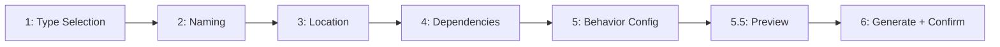

# /fire-scaffold

> Create a feature or component the right way — guided wizard, consistent output

---

## Purpose

Scaffold individual features and components within an active phase using a guided
multi-step wizard. Fills the gap between high-level phase plans (BLUEPRINT.md) and
ad-hoc feature creation.

**Why this command exists:** Phase planning scopes WHAT to build. Scaffolding
guides HOW to build it consistently — same structure, same conventions, every time.

---

## Arguments

```yaml
arguments:
  type:
    required: false
    type: string
    choices: [component, endpoint, model, page, hook, service, test, custom]
    description: "What to scaffold (prompted if not provided)"
    example: "/fire-scaffold component"

optional_flags:
  --name: "Pre-fill the name (will prompt if not provided)"
  --phase: "Phase number to add this to (defaults to current phase)"
  --dry-run: "Show generated files without writing them"
  --minimal: "Skip optional steps, use smart defaults"
```

---

## Wizard Step Sequence



> LLM step adherence. LLMREI (arXiv 2507.02564) — 5-step interview protocol.
> Clack group() (7.4k★) — results-passing between steps for conditional branching.

---

## Process

### Step 1: Type Selection

```
━━━━━━━━━━━━━━━━━━━━━━━━━━━━━━━━━━━━━━━━━━━━━━━━━━━━━━━━━━━━━━━━━━━━━━━━
                        DOMINION FLOW ► SCAFFOLD
━━━━━━━━━━━━━━━━━━━━━━━━━━━━━━━━━━━━━━━━━━━━━━━━━━━━━━━━━━━━━━━━━━━━━━━━

What are you creating?

  1. React Component    - UI component with props, state, tests
  2. API Endpoint       - Route handler, validation, error responses
  3. Database Model     - Schema, migrations, type definitions
  4. Page               - Full route page with layout, data loading
  5. Custom Hook        - Reusable React hook with tests
  6. Service/Module     - Business logic module with interface
  7. Test Suite         - Test file for an existing module
  8. Custom             - Describe it — I'll derive the scaffold

> [User selection]
```

**Conditional branching based on type selection:**
- Component → asks about props interface, styling approach, storybook
- Endpoint → asks about HTTP method, auth required, request/response shape
- Model → asks about fields, relationships, indexes, migration strategy
- Page → asks about data requirements, auth guard, SEO needs
- Hook → asks about parameters, return shape, dependencies
- Service → asks about interface contract, dependencies, error strategy

### Step 2: Naming

```
STEP 2 of 6 — Naming
──────────────────────────────────────────────────

What will this {type} be called?

Name (PascalCase for components, kebab-case for files):
> [User input]

Checking conventions...
✓ Name format valid
✓ No existing file found at expected path
```

**Validate input before advancing:**
- Check naming convention (PascalCase vs kebab-case by type)
- Check for existing file at the expected output path
- If conflict found: warn and ask to confirm overwrite or rename

### Step 3: Location

```
STEP 3 of 6 — Location
──────────────────────────────────────────────────

Where should this live in the project?

Suggested location (based on codebase conventions):
  {suggested-path}

  [✓ Use suggested path]
  [Custom path — I'll specify]
  [Show me similar files for reference]
```

**Auto-detect codebase conventions:**
- Scan existing files of the same type for location patterns
- Suggest the most consistent path based on what already exists
- If no pattern detected: use sensible defaults from project type (from template in fire-1a-new)

### Step 4: Dependencies

```
STEP 4 of 6 — Dependencies
──────────────────────────────────────────────────

Does this {type} depend on anything?

Detected from codebase scan:
  - {likely-dep-1} (used by similar files)
  - {likely-dep-2} (used by similar files)

Additional dependencies to import:
> [User input, or Enter to skip]
```

**Missing-dimension check (proactive):**
Ask internally: "What dependency is commonly required for a {type} of this kind that
hasn't been mentioned?" If any critical dependency is missing, ask ONE follow-up.
### Step 5: Behavior Configuration

**Ask type-specific configuration questions (max 4, one at a time):**

```
STEP 5 of 6 — Behavior
──────────────────────────────────────────────────

{Type-specific question 1 of max 4}

  A) {Concrete option 1}
  B) {Concrete option 2}
  C) You decide (Claude's judgment)

> [User selection]
```

**Conditional branching examples (Clack group() results pattern):**

```
Component:
  Q1: Does this component have local state? (stateful/stateless/both)
  Q2: Should it accept a className prop for external styling?
  Q3: Will it need loading/error/empty states?
  Q4: Add to Storybook?

Endpoint:
  Q1: HTTP method? (GET/POST/PUT/DELETE/PATCH)
  Q2: Requires authentication? (none/JWT/API key/role-based)
  Q3: Does it modify database state? (read-only/writes/deletes)
  Q4: Rate limiting needed?
```

**Per-step self-check before advancing:**
Ask internally: "Is the answer to Q{N} specific enough to write code from, or is it
still ambiguous?" If ambiguous — follow up once before advancing.

### Step 5.5: Preview Before Generating

```
STEP 5.5 of 6 — Preview
──────────────────────────────────────────────────

Here's what will be generated:

FILES TO CREATE:
  {output-path}/{Name}.{ext}           ← main file
  {output-path}/{Name}.test.{ext}      ← test file (if applicable)
  {output-path}/{Name}.stories.{ext}   ← storybook (if selected)

SKELETON PREVIEW:
  ─────────────────────────────────────
  {First 20 lines of generated content}
  ...
  ─────────────────────────────────────

UPDATES TO EXISTING FILES:
  {barrel-file} — adds export for {Name}
  {route-file}  — registers endpoint (if endpoint type)

[✓ Generate these files]
[Edit a previous answer]
[Cancel]
```

> Showing the output before writing prevents formatting errors users only discover
> after the file is saved. The "No Hardware, No Problem" paper (ACM C&C 2025)
> validated that pre-generation simulation dramatically improves confidence.

### Step 6: Generate & Confirm

Generate all selected files, then display:

```
╔══════════════════════════════════════════════════════════════════════════════╗
║ ✓ SCAFFOLD COMPLETE                                                          ║
╠══════════════════════════════════════════════════════════════════════════════╣
║                                                                              ║
║  WHAT WAS CREATED:                                                           ║
║  [✓] {output-path}/{Name}.{ext}             ← {type}                        ║
║  [✓] {output-path}/{Name}.test.{ext}        ← tests                         ║
║  [✓] {barrel-file} updated                  ← export added                  ║
║                                                                              ║
║  CHECKLIST:                                                                  ║
║  [✓] Name convention validated               ║
║  [✓] No file conflict                        ║
║  [✓] Dependencies included                   ║
║  [✓] Type-specific config applied            ║
║  [✓] Tests scaffolded                        ║
║  [✓] Export registered                       ║
║                                                                              ║
╠══════════════════════════════════════════════════════════════════════════════╣
║ NEXT STEPS                                                                   ║
├──────────────────────────────────────────────────────────────────────────────┤
║                                                                              ║
║  1. Implement {Name} logic in: {output-path}/{Name}.{ext}                    ║
║  2. Fill in tests in: {output-path}/{Name}.test.{ext}                        ║
║  3. Reference in plan: add to BLUEPRINT.md task list if not already there    ║
║                                                                              ║
╚══════════════════════════════════════════════════════════════════════════════╝
```

---

## Related Commands

- `/fire-2-plan` — Plan the phase that contains this feature
- `/fire-3-execute` — Execute the full plan (uses scaffolded files as targets)
- `/fire-add-new-skill` — If you discovered a reusable pattern while scaffolding
- `/fire-1d-discuss` — Re-discuss a phase to clarify what needs scaffolding

---

## Success Criteria

- [ ] Type selected and conditional questions generated
- [ ] Name validated against conventions
- [ ] Location auto-detected or user-confirmed
- [ ] Dependencies identified (including proactive check)
- [ ] Behavior configured (max 4 type-specific questions)
- [ ] Preview shown before any file writes
- [ ] Files generated at correct paths
- [ ] Exports/registrations updated
- [ ] Completion checklist displayed with next steps

---

## Research Basis

> **v12.3 — Wizard Creation Research:**
>
> - Gap #1 (WIZARD-FLOW+STATE, impact 5/5 — highest impact gap): No feature/component
>   scaffolding wizard existed. Planners couldn't reference `/fire-scaffold` in task
>   specs, leaving feature creation ad-hoc and inconsistent.
>
> - LLMREI (arXiv 2507.02564, 2025): 5-step requirements interview protocol — scope,
>   constraints, components, validate, confirm — maps directly to this wizard's steps.
>
> - Clack group() (bombshell-dev/clack, 7.4k★, 4.70/5.00): results-passing pattern
>   for conditional step branching. Each step function receives `{ results }` of all
>   prior answers; returning undefined skips a step conditionally.
>
> - Proactive T2I Agents (arXiv 2412.06771): visible belief graph — show wizard's
>   current understanding as editable structured state (Preview step 5.5).
>
> - Devin Interactive Planning (score 89/100): Show what will be created BEFORE
>   consuming resources. The Preview step maps directly to Devin's plan approval gate.
