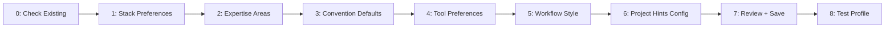

# /fire-setup

> Configure your Dominion Flow developer profile — answer 8 questions, unlock personalized wizard behavior

---

## Purpose

Run once (or re-run to update preferences). Writes a `~/.claude/developer-profile.md`
file that all Dominion Flow wizards read automatically, eliminating repetitive
onboarding questions across projects.

**Before this command:** Every new project starts from scratch — stack choices,
convention preferences, tool habits are re-asked from zero.

**After this command:** Wizards skip questions already answered in your profile.
`/fire-1a-new` pre-selects your preferred stack. `/fire-add-new-skill` pre-fills
your most-used category. `/fire-1d-discuss` knows your expertise areas.

---

## Arguments

```yaml
arguments: none

optional_flags:
  --update: "Re-run only the sections you want to change"
  --view:   "Show current profile without editing"
  --reset:  "Clear profile and start fresh"
```

---

## Wizard Step Sequence



---

## Process

### Step 0: Check Existing Profile

```bash
test -f ~/.claude/developer-profile.md && echo "EXISTS" || echo "NEW"
```

**If profile exists and `--update` not specified:**
```
Your developer profile was last updated on {date}.

[View profile]    [Update sections]    [Reset and re-run]
```

**If new or `--reset`:** Begin from Step 1.

### Step 1: Stack Preferences

```
━━━━━━━━━━━━━━━━━━━━━━━━━━━━━━━━━━━━━━━━━━━━━━━━━━━━━━━━━━━━━━━━━━━━━━━━
                    DOMINION FLOW ► DEVELOPER PROFILE SETUP
━━━━━━━━━━━━━━━━━━━━━━━━━━━━━━━━━━━━━━━━━━━━━━━━━━━━━━━━━━━━━━━━━━━━━━━━

Step 1 of 7 — Your Preferred Tech Stack
──────────────────────────────────────────────────────

This profile saves you from answering the same questions on every project.
These are defaults — you can always override per-project.

Frontend framework:
  1. React (Vite)     2. React (Next.js)    3. Vue
  4. Svelte           5. Vanilla JS          6. No preference
> [User selection]

Backend runtime:
  1. Node.js (Express)    2. Node.js (Fastify)    3. Bun
  4. Python (FastAPI)     5. Python (Django)       6. No preference
> [User selection]

Preferred database:
  1. PostgreSQL (Supabase)    2. PostgreSQL (direct)    3. MySQL
  4. SQLite                   5. No preference
> [User selection]

ORM/Query builder:
  1. Prisma    2. Drizzle    3. Knex    4. Raw SQL    5. No preference
> [User selection]
```

### Step 2: Expertise Areas

```
Step 2 of 7 — Your Expertise
──────────────────────────────────────────────────────

Where are you strongest? (multiselect — select all that apply)

  [ ] Frontend / UI
  [ ] Backend / API design
  [ ] Database design and optimization
  [ ] DevOps / Infrastructure / Deployment
  [ ] Security
  [ ] Testing (unit, integration, E2E)
  [ ] Mobile (React Native, Swift, Kotlin)
  [ ] AI / LLM integration
  [ ] Other: ___

This tells wizards how deep to go on explanations and which
follow-up questions to skip (expert areas = fewer clarifying Qs).
```

### Step 3: Convention Defaults

```
Step 3 of 7 — Code Conventions
──────────────────────────────────────────────────────

TypeScript or JavaScript?
  1. Always TypeScript    2. Prefer TS, JS ok    3. No preference

Testing framework:
  1. Vitest    2. Jest    3. Other    4. No preference

CSS approach:
  1. Tailwind CSS    2. CSS Modules    3. Styled Components
  4. Plain CSS       5. No preference

Code style:
  1. ESLint + Prettier    2. Biome    3. None    4. No preference
```

### Step 4: Tool Preferences

```
Step 4 of 7 — Tools
──────────────────────────────────────────────────────

Package manager:
  1. npm    2. bun    3. pnpm    4. yarn    5. No preference

Git workflow:
  1. Conventional Commits (feat:, fix:, chore:)
  2. Descriptive messages (no prefix convention)
  3. No preference

Deployment target (most common):
  1. Vercel    2. Railway    3. Fly.io    4. VPS/Docker
  5. Cloudflare Workers    6. No preference
```

### Step 5: Workflow Style

```
Step 5 of 7 — Workflow Style
──────────────────────────────────────────────────────

When building features, I prefer to:
  1. Plan fully before any code
  2. Sketch the plan, then iterate while building
  3. Build a spike first, then plan properly

When something's unclear, I want Claude to:
  1. Ask clarifying questions before starting
  2. Make reasonable assumptions and note them
  3. Describe options and let me choose

Discussion depth (for /fire-1d-discuss):
  1. Quick (2 questions per area — fast decisions)
  2. Standard (4 questions per area — thorough)
  3. Deep (6+ questions — nothing left ambiguous)
```

### Step 6: Project Hints Config

```
Step 6 of 7 — Project-Level Hints
──────────────────────────────────────────────────────

Dominion Flow can write a .claude/project-hints.md in each new project
to capture project-specific conventions so future sessions skip setup Qs.

Enable project hints?
  1. Yes — auto-generate project-hints.md during /fire-1c-setup
  2. No — I'll manage context manually

(You can change this per-project)
```

> Answer project setup questions once, store as structured context, never ask again.

### Step 7: Review & Save

Display full profile summary for confirmation before writing:

```
DEVELOPER PROFILE REVIEW
══════════════════════════════════════════════════════════

  Frontend:     {selection}          [Edit]
  Backend:      {selection}          [Edit]
  Database:     {selection}          [Edit]
  ORM:          {selection}          [Edit]
  Expertise:    {list}               [Edit]
  TypeScript:   {preference}         [Edit]
  Testing:      {framework}          [Edit]
  CSS:          {approach}           [Edit]
  Package mgr:  {selection}          [Edit]
  Git style:    {convention}         [Edit]
  Deploy:       {target}             [Edit]
  Discussion:   {depth}              [Edit]
  Proj hints:   {yes/no}             [Edit]

══════════════════════════════════════════════════════════

[✓ Save profile]   [Edit a section]   [Cancel]
```

**If user selects Edit a section:** Return to that step, collect new answer, re-show review.

### Step 8: Save and Test

```bash
# Save to global profile location
cat > ~/.claude/developer-profile.md << 'EOF'
{generated profile content}
EOF
```

**Test profile reading:**
Verify that `/fire-1a-new` would correctly read and apply this profile:
```
Verifying profile integration...
  ✓ fire-1a-new stack pre-selection: {stack}
  ✓ fire-1d-discuss depth default: {depth}
  ✓ fire-add-new-skill category history: enabled
  ✓ fire-scaffold naming convention: {convention}
```

**Display confirmation:**

```
╔══════════════════════════════════════════════════════════════════════════════╗
║ ✓ DEVELOPER PROFILE SAVED                                                    ║
╠══════════════════════════════════════════════════════════════════════════════╣
║                                                                              ║
║  Saved to: ~/.claude/developer-profile.md                                    ║
║                                                                              ║
║  WHAT CHANGES NOW:                                                           ║
║  [✓] /fire-1a-new will pre-select your stack defaults                        ║
║  [✓] /fire-1d-discuss will use your discussion depth preference              ║
║  [✓] /fire-scaffold will apply your naming conventions                       ║
║  [✓] /fire-add-new-skill will remember your most-used categories             ║
║  [✓] New projects get project-hints.md if enabled                            ║
║                                                                              ║
║  To update: /fire-setup --update                                             ║
║  To view:   /fire-setup --view                                               ║
║                                                                              ║
╚══════════════════════════════════════════════════════════════════════════════╝
```

---

## Profile File Format

Saved as `~/.claude/developer-profile.md`:

```markdown
---
# Dominion Flow Developer Profile
# Created: {date}
# Updated: {date}
# Version: 1.0

stack:
  frontend: "react-vite"
  backend: "node-express"
  database: "postgresql-supabase"
  orm: "prisma"
  language: "typescript"
  css: "tailwind"
  testing: "vitest"
  package_manager: "bun"
  git_style: "conventional-commits"
  deploy: "vercel"

expertise:
  - frontend
  - backend
  - database

workflow:
  feature_approach: "plan-first"
  ambiguity_handling: "ask"
  discussion_depth: "standard"  # quick | standard | deep
  project_hints: true

preferences:
  explanation_depth: "skip-basics-for-expert-areas"
  confirmation_style: "checkpoint-per-area"
---

# Notes

{Any freeform notes the user added about their setup or preferences}
```

---

## Related Commands

- `/fire-1a-new` — Reads this profile to pre-select stack and template defaults
- `/fire-1d-discuss` — Reads discussion_depth preference
- `/fire-scaffold` — Reads naming conventions and testing framework
- `/fire-add-new-skill` — Reads expertise areas to pre-filter categories

---

## Success Criteria

- [ ] Existing profile checked before starting
- [ ] All 7 topic areas covered (stack, expertise, conventions, tools, workflow, hints)
- [ ] Review panel shown before saving
- [ ] User can edit any section from review panel
- [ ] Profile written to `~/.claude/developer-profile.md`
- [ ] Profile integration verified with test pass
- [ ] Completion confirmation shows which commands are now personalized

---

## Research Basis

> **v12.3 — Wizard Creation Research:**
>
> - Lovable two-level wizard pattern (score 78/100): Separate one-time platform
>   onboarding ("who are you?") from per-project creation ("what are you building?").
>   The most effective wizard is one the user runs once and benefits from forever.
>
> - Goose (Block) `.goosehints` pattern (score 84/100): Project-level context files
>   eliminate repetitive clarifying questions. Answer once, stored as structured
>   context, all subsequent sessions read it automatically.
>
> - Gap #2 (WIZARD-TEMPLATE, impact 4, ratio 2.0): Without a developer profile,
>   every project template selection is a cold-start guess. With it, the most
>   likely template is pre-selected based on the developer's actual stack.
