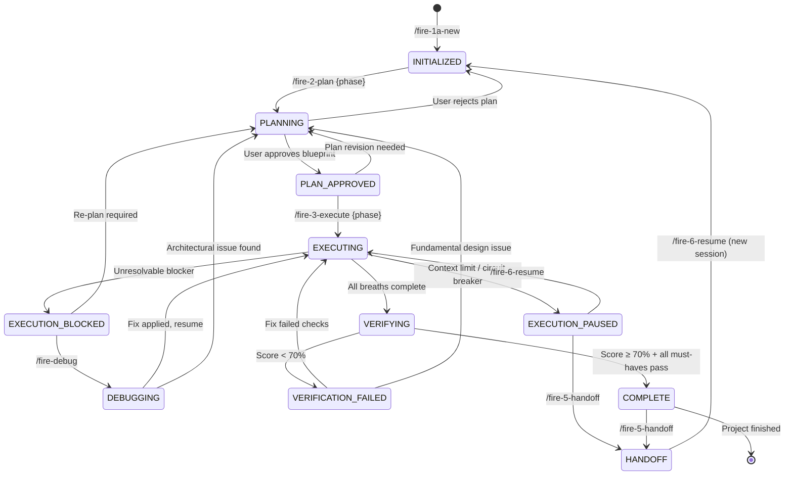

# Phase Transition State Machine

> Formal state diagram governing Dominion Flow phase lifecycle. Every phase must follow these transitions — no skipping, no shortcuts.
---

## State Diagram



---

## States

| State | Description | Entry Command | Valid Exits |
|-------|-------------|---------------|-------------|
| **INITIALIZED** | Project created, no planning done | `/fire-1a-new` | PLANNING |
| **PLANNING** | Blueprint being created for a phase | `/fire-2-plan` | PLAN_APPROVED, INITIALIZED |
| **PLAN_APPROVED** | Blueprint approved, ready to execute | User approval | EXECUTING, PLANNING |
| **EXECUTING** | Code being written in breaths | `/fire-3-execute` | VERIFYING, EXECUTION_PAUSED, EXECUTION_BLOCKED |
| **EXECUTION_PAUSED** | Stopped mid-execution (context limit, break) | Circuit breaker / manual | EXECUTING, HANDOFF |
| **EXECUTION_BLOCKED** | Unresolvable issue during execution | Error escalation | PLANNING, DEBUGGING |
| **DEBUGGING** | Active investigation of a blocker | `/fire-debug` | EXECUTING, PLANNING |
| **VERIFYING** | Running 70-point WARRIOR checklist | `/fire-4-verify` | COMPLETE, VERIFICATION_FAILED |
| **VERIFICATION_FAILED** | Verification score below threshold | Score < 70% | EXECUTING, PLANNING |
| **COMPLETE** | Phase verified and approved | Score ≥ 70% | HANDOFF, next phase |
| **HANDOFF** | Session state saved for continuity | `/fire-5-handoff` | INITIALIZED (new session) |

---

## Transition Guards

Guards are conditions that MUST be true before a transition is allowed.

### PLANNING → PLAN_APPROVED
- [ ] BLUEPRINT.md exists with all required sections
- [ ] At least one breath defined with tasks
- [ ] Skills-to-apply section populated (or explicitly marked "none needed")
- [ ] User has reviewed and approved the blueprint

### PLAN_APPROVED → EXECUTING
- [ ] Blueprint has not been modified since approval
- [ ] No unresolved blockers from previous phases
- [ ] Required dependencies available (APIs, databases, etc.)

### EXECUTING → VERIFYING
- [ ] All breaths in the phase have been attempted
- [ ] No breath is in BLOCKED state without resolution
- [ ] Build passes (if applicable)
- [ ] At least one test exists for non-trivial code

### VERIFYING → COMPLETE
- [ ] Overall verification score ≥ 70%
- [ ] ALL must-have checks pass (truths, artifacts, key links)
- [ ] No critical security findings
- [ ] FaR confidence calibration completed (fact-elicit + reflect)

### EXECUTION_BLOCKED → PLANNING
- [ ] Blocker documented in debug log
- [ ] Root cause identified (or explicitly marked "unknown — needs investigation")
- [ ] Impact assessment: which blueprint tasks are affected

---

## Rollback Paths

When a phase fails verification or hits an unresolvable blocker, these are the safe rollback paths:

| From | To | When | What Happens |
|------|----|------|-------------|
| VERIFICATION_FAILED | EXECUTING | Fixable issues (test failures, missing docs) | Re-execute only failed breath tasks |
| VERIFICATION_FAILED | PLANNING | Design issues (wrong architecture, missing requirements) | Re-plan the phase with lessons learned |
| EXECUTION_BLOCKED | DEBUGGING | Unknown root cause | Launch `/fire-debug` investigation |
| EXECUTION_BLOCKED | PLANNING | Known architectural issue | Re-plan with constraint documented |
| EXECUTING | EXECUTION_PAUSED | Context limit reached | Save state, prepare for `/fire-6-resume` |

---

## State Persistence

Phase state is tracked in `.planning/STATE.md`:

```markdown
## Current State
- Phase: {N}
- State: EXECUTING
- Entered: 2026-03-06T14:30:00Z
- Previous: PLAN_APPROVED (2026-03-06T14:15:00Z)
- Breaths completed: 2/4
- Next transition: VERIFYING (when all breaths complete)
```

The handoff cycle (`/fire-5-handoff` → `/fire-6-resume`) preserves state across sessions. The resuming session reads STATE.md to determine exactly where to continue.

---

## Anti-Patterns

These transitions are **explicitly forbidden**:

| Forbidden Transition | Why |
|---------------------|-----|
| INITIALIZED → EXECUTING | Cannot execute without a plan |
| PLANNING → VERIFYING | Cannot verify unbuilt code |
| EXECUTING → COMPLETE | Cannot skip verification |
| VERIFICATION_FAILED → COMPLETE | Cannot ignore failed verification |
| Any state → HANDOFF (without saving) | Must save state before handoff |

---

## Integration

This state machine is enforced by:
- **`/fire-3-execute`** — Checks current state before starting execution
- **`/fire-4-verify`** — Only runs if state is EXECUTING with all breaths complete
- **`/fire-autonomous`** — Follows state machine transitions automatically
- **`/fire-6-resume`** — Reads STATE.md to determine re-entry point
- **`/fire-transition`** — Explicit phase transition command with guard validation
