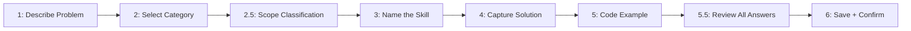

# Mermaid Wizard Diagrams

## Problem

Multi-step wizard commands (commands with 5+ steps) suffer from step-skipping or
out-of-order execution when described only in prose. LLMs compress prose into summaries
and then execute from memory, introducing gaps.

**Symptom:** Wizard jumps from Step 2 to Step 5. Review panel appears before all
information is collected. Steps are merged or reordered.

## Solution

Add a Mermaid `graph LR` diagram immediately after the first `## Process` heading.
The diagram declares all steps and their sequence as machine-readable structure —
not decoration.

```markdown
## Wizard Step Sequence


```

## Rules

1. **Number every node** — `S1`, `S2`, `S25`, `S3` etc. Fractional numbers (2.5) mark
   optional/conditional steps without renumbering the main flow.
2. **Match node labels to section headings** — `S3[3: Name the Skill]` must match
   `### Step 3: Name the Skill` exactly. Inconsistency defeats the purpose.
3. **Place BEFORE the numbered step sections** — The diagram is an index. Prose sections
   follow it in order.
4. **Include conditional steps** — If a step is conditional (e.g., only runs for
   advanced users), include it in the diagram with a note, not omit it.

## When to Add

Add this diagram to ANY command file with 4+ steps. Single-pass commands (read a file,
do a thing, confirm) do not need it.

**Existing commands updated in v12.3:**
- `fire-1d-discuss.md`
- `fire-add-new-skill.md`
- `fire-scaffold.md`
- `fire-setup.md`

## Why It Works

**FlowBench (EMNLP 2024):** Multi-step task benchmarks show LLMs adhere to step
sequences significantly better when the sequence is expressed as graph structure vs.
prose description. Mermaid is the most widely-parsed graph format in training data.

**Mechanism:** Graph format creates an explicit index the LLM can refer back to.
Prose is summarized into compressed representations; structured diagrams are parsed
as literal sequences.

## Research Basis

> **FlowBench** (EMNLP 2024) — Multi-step workflow evaluation. Mermaid graph format
> improves LLM step adherence vs. prose descriptions of the same sequence.
> Applied: All wizard commands now open their Process section with a Mermaid step map.
