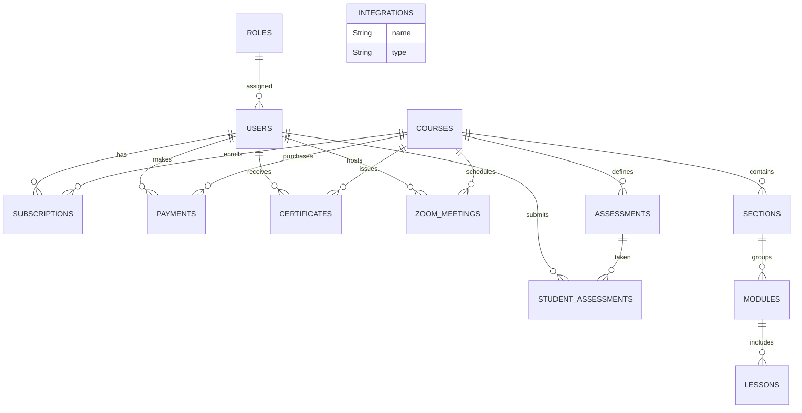

# Database Schema and Relationships

This document outlines the MongoDB (Mongoose) schema definitions and their relationships for the MERN Community LMS. It can serve as a reference for migrating the database structure to Supabase.

---

## Collections & Tables

### 1. users

Fields:
- _id: UUID/ObjectId (Primary Key)
- name: String (required)
- email: String (required, unique)
- password: String (hashed, required)
- role: String (e.g., "admin", "teacher", "user")
- roles: Array<ObjectId> → roles._id (many-to-many)
- resetPasswordToken: String
- resetPasswordExpire: Date
- createdAt: Date
- updatedAt: Date

Relationships:
- users.roles → roles._id (many-to-many via `roles` array)
- users → subscriptions.user (one-to-many)
- users → payments.user (one-to-many)
- users → studentAssessments.student (one-to-many)
- users → certificates.student (one-to-many)
- users → zoomMeetings.hostId (one-to-many)

---

### 2. roles

Fields:
- _id: ObjectId (Primary Key)
- name: String (required, unique)
- permissions: Array<Permission>
  - Permission.resource: String
  - Permission.actions: Array<String>
- createdAt: Date
- updatedAt: Date

Relationships:
- roles → users.roles (many-to-many)

---

### 3. courses

Fields:
- _id: ObjectId (Primary Key)
- title: String (required)
- slug: String (unique)
- description: String (required)
- shortDescription: String
- level: Enum("beginner","intermediate","advanced","all-levels")
- category: String
- topics: Array<String>
- thumbnail: String
- coverImage: String
- price: Number
- discountPrice: Number
- discountExpireDate: Date
- duration: Number (minutes)
- requirements: Array<String>
- learningObjectives: Array<String>
- instructor: ObjectId → users._id (required)
- isPublished: Boolean
- isApproved: Boolean
- isFeatured: Boolean
- enrollmentCount: Number
- rating: Number
- numReviews: Number
- membershipRequired: Enum("none","free","basic","premium")
- createdAt: Date
- updatedAt: Date

Relationships:
- courses.instructor → users._id (many-to-one)
- courses → sections.course (one-to-many)
- courses → modules via sections → lessons via modules (nested)
- courses → assessments.course (one-to-many)
- courses → payments.course (one-to-many)
- courses → subscriptions via user subscription
- courses → certificates.course (one-to-many)

---

### 4. sections

Fields:
- _id: ObjectId (Primary Key)
- title: String (required)
- description: String
- course: ObjectId → courses._id (required)
- order: Number (required)
- isPublished: Boolean
- createdAt: Date
- updatedAt: Date

Relationships:
- sections.course → courses._id (many-to-one)
- sections → modules.section (one-to-many)

---

### 5. modules

Fields:
- _id: ObjectId (Primary Key)
- title: String (required)
- description: String
- course: ObjectId → courses._id (required)
- section: ObjectId → sections._id (required)
- order: Number (required)
- duration: Number (minutes)
- isPublished: Boolean
- createdAt: Date
- updatedAt: Date

Relationships:
- modules.section → sections._id (many-to-one)
- modules.course → courses._id (many-to-one)
- modules → lessons.module (one-to-many)

---

### 6. lessons

Fields:
- _id: ObjectId (Primary Key)
- title: String (required)
- description: String
- course: ObjectId → courses._id (required)
- section: ObjectId → sections._id
- module: ObjectId → modules._id
- order: Number (required)
- contentType: Enum("video","text","quiz","assignment","document")
- content: String
- video: {
    originalName: String,
    url: String,
    provider: Enum("custom","youtube","vimeo"),
    thumbnailUrl: String,
    duration: Number (seconds),
    status: Enum("uploading","processing","processed","failed"),
    processingError: String
  }
- attachments: Array<{ name: String, file: String, type: String }>
- isFree: Boolean
- isPublished: Boolean
- isPreview: Boolean
- createdAt: Date
- updatedAt: Date

Relationships:
- lessons.module → modules._id (many-to-one)

---

### 7. assessments

Fields:
- _id: ObjectId (Primary Key)
- title: String (required)
- description: String
- course: ObjectId → courses._id
- module: ObjectId → modules._id
- lesson: ObjectId → lessons._id
- timeLimit: Number (minutes)
- passingScore: Number (percentage)
- maxAttempts: Number
- shuffleQuestions: Boolean
- shuffleOptions: Boolean
- showResults: Enum("immediately","after_submission","after_all_attempts","never")
- releaseDate: Date
- dueDate: Date
- questions: Array<{
    text: String,
    type: String,
    options: Array<{ text: String, isCorrect: Boolean }>,
    correctAnswer: Mixed,
    acceptableAnswers: Array<String>,
    matchingPairs: Array<{ left: String, right: String }>,
    points: Number,
    explanation: String,
    difficulty: String,
    tags: Array<String>,
    category: String
  }>
- averageScore: Number
- completionCount: Number
- passCount: Number
- isPublished: Boolean
- isRequired: Boolean
- isFinal: Boolean
- allowCertificate: Boolean
- createdAt: Date
- updatedAt: Date

Relationships:
- assessments.course → courses._id (many-to-one)
- assessments → studentAssessments.assessment (one-to-many)

---

### 8. studentAssessments

Fields:
- _id: ObjectId (Primary Key)
- student: ObjectId → users._id
- assessment: ObjectId → assessments._id
- answers: Array<Answer>
  - questionId: ObjectId
  - response: Mixed
  - isCorrect: Boolean
- score: Number
- status: String
- submittedAt: Date
- createdAt: Date
- updatedAt: Date

Relationships:
- studentAssessments.student → users._id (many-to-one)
- studentAssessments.assessment → assessments._id (many-to-one)

---

### 9. certificates

Fields:
- _id: ObjectId (Primary Key)
- user: ObjectId → users._id
- course: ObjectId → courses._id
- issuedDate: Date
- expiryDate: Date
- certificateNumber: String (unique)
- status: Enum("issued","revoked","expired")
- completionScore: Number
- metadata: { hours: Number, level: String, skills: Array<String>, customFields: Map<String> }
- certificateUrl: String
- verificationHash: String (unique)
- verificationAttempts: Array<{
    ipAddress: String,
    timestamp: Date,
    userAgent: String,
    verified: Boolean
  }>
- createdAt: Date
- updatedAt: Date

Relationships:
- certificates.student → users._id (many-to-one)
- certificates.course → courses._id (many-to-one)

---

### 10. subscriptions

Fields:
- _id: ObjectId (Primary Key)
- user: ObjectId → users._id
- plan: Enum("free","basic","premium")
- status: Enum("active","canceled","expired","past_due","trialing","incomplete","incomplete_expired")
- stripeCustomerId: String
- stripeSubscriptionId: String
- stripePriceId: String
- stripeCurrentPeriodEnd: Date
- stripeCanceledAt: Date
- cancelAtPeriodEnd: Boolean
- features: { coursesAccess: String, downloadableResources: Boolean, certificates: Boolean, zoomMinutesPerMonth: Number, communityAccess: Boolean, maxCoursesEnrollment: Number, prioritySupport: Boolean }
- usage: { zoomMinutesUsed: Number, coursesEnrolled: Number, resourcesDownloaded: Number, lastResetDate: Date }
- billingDetails: { name: String, email: String, address: { line1, line2, city, state, postal_code, country }, taxId: String }
- paymentHistory: Array<ObjectId> → payments._id
- metadata: Map<String>
- createdAt: Date
- updatedAt: Date

Relationships:
- subscriptions.user → users._id (many-to-one)

---

### 11. payments

Fields:
- _id: ObjectId (Primary Key)
- user: ObjectId → users._id
- course: ObjectId → courses._id
- amount: Number
- currency: String
- status: String
- paymentMethod: String
- createdAt: Date
- updatedAt: Date

Relationships:
- payments.user → users._id (many-to-one)
- payments.course → courses._id (many-to-one)

---

### 12. integrations

Fields:
- _id: ObjectId (Primary Key)
- name: String (required, unique)
- type: Enum("zapier","n8n","webhook","email","zoom","stripe","custom")
- description: String
- isActive: Boolean
- apiKey: String
- apiSecret: String
- accessToken: String
- refreshToken: String
- tokenExpiresAt: Date
- authUrl: String
- tokenUrl: String
- redirectUrl: String
- scope: String
- webhooks: Array<{
    url: String,
    events: Array<String>,
    description: String,
    isActive: Boolean,
    secretKey: String,
    createdBy: ObjectId → users._id,
    lastTriggered: Date,
    failureCount: Number,
    lastFailureReason: String,
    lastSuccessfulDelivery: Date
  }>
- status: Enum("connected","disconnected","error","pending")
- settings: Map<Mixed>
- metadata: Map<Mixed>
- usageCount: Number
- lastUsed: Date
- createdBy: ObjectId → users._id
- createdAt: Date
- updatedAt: Date

No direct cross-collection references, used for audit/history.

---

### 13. zoomMeetings

Fields:
- _id: ObjectId (Primary Key)
- meetingId: String
- topic: String
- startTime: Date
- duration: Number
- joinUrl: String
- hostId: ObjectId → users._id
- course: ObjectId → courses._id
- module: ObjectId → modules._id
- lesson: ObjectId → lessons._id
- createdAt: Date
- updatedAt: Date

Relationships:
- zoomMeetings.hostId → users._id (many-to-one)
- zoomMeetings.course → courses._id (many-to-one)
- zoomMeetings.module → modules._id (many-to-one)
- zoomMeetings.lesson → lessons._id (many-to-one)

---

## ER Diagram Overview

