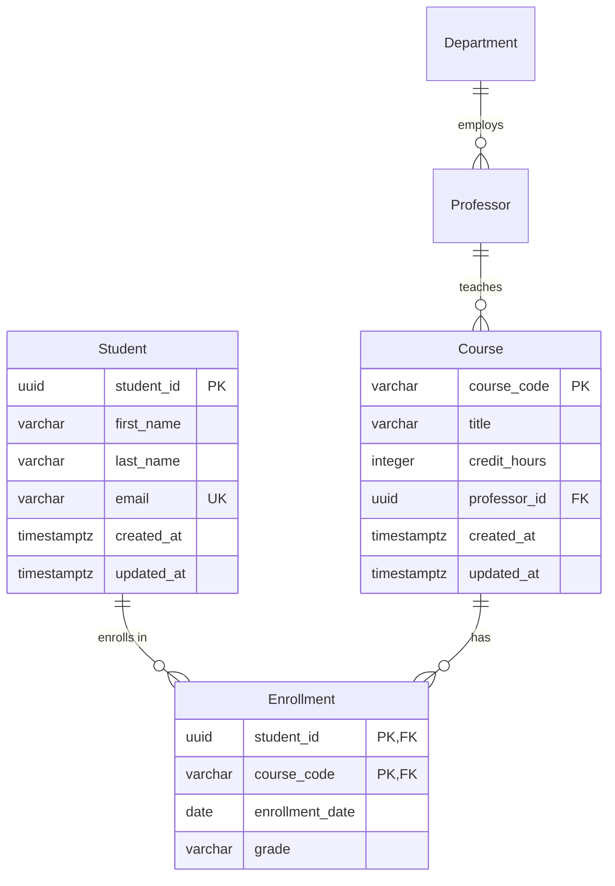

# AI-Powered ERD Generator


## Problem

Generating database ER diagrams from natural language descriptions requires decomposing ambiguous human requirements into precise entities, relationships, and constraints. Traditional approaches demand a database architect to manually interpret requirements, identify entities, define relationships, assign cardinalities, and produce normalized schemas. This is slow, error-prone, and inaccessible to non-experts.

LLMs can now automate this pipeline, but single-prompt approaches fail because:
- **Entity extraction** and **relationship classification** are fundamentally different reasoning tasks
- LLMs hallucinate cardinalities (the #1 failure mode per Cogent Education 2025)
- Single-pass generation misses implicit constraints and cross-entity dependencies
- No self-verification means errors compound silently

The solution: a **multi-agent pipeline** where specialized agents handle decomposed sub-tasks, with explicit verification gates between stages.

---

## Multi-Agent Pipeline Architecture

Inspired by NOMAD (arXiv 2511.22409) and Text2Schema (arXiv 2503.23886). Five agents with clear I/O contracts, each invocable independently or as a chain.

```
NL Requirements
      |
      v
+---------------------+
| Agent 1: Entity     |  NL -> Entity List + Attributes
| Extractor           |
+---------------------+
      |
      v
+---------------------+
| Agent 2: Relationship|  Entities + NL -> Relationships + Cardinality
| Classifier          |
+---------------------+
      |
      v
+---------------------+
| Agent 3: Constraint |  Entities + Relationships -> PKs, FKs, Constraints
| Integrator          |
+---------------------+
      |
      v
+---------------------+
| Agent 4: Schema     |  Full Model -> SQL DDL / JSON Schema / Mermaid
| Articulator         |
+---------------------+
      |
      v
+---------------------+
| Agent 5: Verifier   |  DDL + Original NL -> Validation Report
|                     |
+---------------------+
      |
      v
  Verified ERD + DDL
```

---

## Agent 1: Entity Extractor

**Role:** Extract entities and their attributes from natural language requirements.

**Input:** Raw natural language description of the system.
**Output:** Structured JSON of entities with typed attributes.

### Prompt Template

```
SYSTEM:
You are a database entity extraction agent. Your ONLY job is to identify
entities (nouns that represent storable objects) and their attributes from
natural language requirements. You do NOT define relationships — another
agent handles that.

Rules:
1. Each entity must have a clear identity (something that makes instances unique)
2. Mark the likely primary key attribute with [PK]
3. Classify each attribute: simple, composite, multivalued, or derived
4. Flag weak entities that cannot exist without a parent (mark [WEAK])
5. Include data type suggestions (string, integer, decimal, date, boolean, text, enum)
6. If an attribute could be an entity itself (has its own attributes), extract it as a separate entity
7. Do NOT invent attributes not implied by the requirements
8. DO mark attributes as [REQUIRED] or [OPTIONAL] based on context

OUTPUT FORMAT (strict JSON):
{
  "entities": [
    {
      "name": "EntityName",
      "type": "strong" | "weak",
      "description": "One-line purpose",
      "owner_entity": null | "ParentEntityName",
      "attributes": [
        {
          "name": "attribute_name",
          "data_type": "string|integer|decimal|date|boolean|text|enum|uuid",
          "attribute_type": "simple|composite|multivalued|derived",
          "constraints": ["PK", "REQUIRED", "OPTIONAL", "UNIQUE"],
          "enum_values": ["val1", "val2"],
          "sub_attributes": ["child1", "child2"],
          "derived_from": "source_description",
          "description": "What this attribute represents"
        }
      ]
    }
  ],
  "ambiguities": [
    "List anything unclear in the requirements that could affect entity design"
  ]
}

USER:
Extract all database entities and their attributes from the following requirements:

---
{REQUIREMENTS_TEXT}
---

Think step-by-step:
1. Identify all nouns that represent storable business objects
2. For each, list its descriptive properties
3. Determine which attributes are keys, required, or optional
4. Flag any weak entities
5. Note ambiguities for human review
```

### Example Input/Output

**Input:**
> "We need a system for a university. Students enroll in courses. Each course is taught by a professor. Professors belong to departments. Students have names, emails, and phone numbers (they can have multiple). Each course has a code, title, and credit hours. Departments have a name and building location."

**Output:**
```json
{
  "entities": [
    {
      "name": "Student",
      "type": "strong",
      "description": "A person enrolled in the university",
      "owner_entity": null,
      "attributes": [
        {"name": "student_id", "data_type": "uuid", "attribute_type": "simple", "constraints": ["PK"], "description": "Unique student identifier"},
        {"name": "name", "data_type": "string", "attribute_type": "composite", "constraints": ["REQUIRED"], "sub_attributes": ["first_name", "last_name"], "description": "Student full name"},
        {"name": "email", "data_type": "string", "attribute_type": "simple", "constraints": ["REQUIRED", "UNIQUE"], "description": "Student email address"},
        {"name": "phone_numbers", "data_type": "string", "attribute_type": "multivalued", "constraints": ["OPTIONAL"], "description": "Student phone numbers (multiple allowed)"}
      ]
    },
    {
      "name": "Course",
      "type": "strong",
      "description": "An academic course offered by the university",
      "owner_entity": null,
      "attributes": [
        {"name": "course_code", "data_type": "string", "attribute_type": "simple", "constraints": ["PK", "UNIQUE"], "description": "Unique course code (e.g., CS101)"},
        {"name": "title", "data_type": "string", "attribute_type": "simple", "constraints": ["REQUIRED"], "description": "Course title"},
        {"name": "credit_hours", "data_type": "integer", "attribute_type": "simple", "constraints": ["REQUIRED"], "description": "Number of credit hours"}
      ]
    },
    {
      "name": "Professor",
      "type": "strong",
      "description": "A faculty member who teaches courses",
      "owner_entity": null,
      "attributes": [
        {"name": "professor_id", "data_type": "uuid", "attribute_type": "simple", "constraints": ["PK"], "description": "Unique professor identifier"},
        {"name": "name", "data_type": "string", "attribute_type": "simple", "constraints": ["REQUIRED"], "description": "Professor name"},
        {"name": "email", "data_type": "string", "attribute_type": "simple", "constraints": ["REQUIRED", "UNIQUE"], "description": "Professor email"}
      ]
    },
    {
      "name": "Department",
      "type": "strong",
      "description": "An academic department within the university",
      "owner_entity": null,
      "attributes": [
        {"name": "department_id", "data_type": "uuid", "attribute_type": "simple", "constraints": ["PK"], "description": "Unique department identifier"},
        {"name": "name", "data_type": "string", "attribute_type": "simple", "constraints": ["REQUIRED", "UNIQUE"], "description": "Department name"},
        {"name": "building", "data_type": "string", "attribute_type": "simple", "constraints": ["OPTIONAL"], "description": "Building location"}
      ]
    }
  ],
  "ambiguities": [
    "Should professors have a department_id FK or can they belong to multiple departments?",
    "Is enrollment a simple relationship or does it carry attributes (grade, semester, enrollment_date)?",
    "Can a course be taught by multiple professors (team-teaching)?"
  ]
}
```

---

## Agent 2: Relationship Classifier

**Role:** Identify all relationships between entities, classify cardinality and participation.

**Input:** Entity list (from Agent 1) + original NL requirements.
**Output:** Structured JSON of relationships with cardinality and participation.

### Prompt Template

```
SYSTEM:
You are a database relationship classification agent. Given a list of entities
and the original requirements, identify ALL relationships between entities.

Rules:
1. Classify each relationship: 1:1, 1:N, or M:N
2. Determine participation: total (mandatory) or partial (optional) for EACH side
3. Identify relationship attributes (properties of the relationship itself, not the entities)
4. Flag recursive/unary relationships (entity relates to itself)
5. For M:N relationships, note that a junction table will be needed
6. CRITICAL: Cardinalities are the #1 error source in LLM-generated ERDs.
   For each cardinality, provide your reasoning. Ask: "Can ONE instance of A
   be associated with MANY instances of B? Can ONE instance of B be associated
   with MANY instances of A?"
7. When uncertain about cardinality, default to the MORE FLEXIBLE option (M:N)
   and flag for human review — it is easier to tighten than to loosen later

OUTPUT FORMAT (strict JSON):
{
  "relationships": [
    {
      "name": "descriptive_verb_phrase",
      "entity_a": "EntityName",
      "entity_b": "EntityName",
      "cardinality": "1:1" | "1:N" | "M:N",
      "participation_a": "total" | "partial",
      "participation_b": "total" | "partial",
      "cardinality_reasoning": "Explain WHY this cardinality was chosen",
      "relationship_attributes": [
        {"name": "attr", "data_type": "type", "description": "purpose"}
      ],
      "is_identifying": false,
      "notes": "Any special considerations"
    }
  ],
  "cardinality_warnings": [
    "List relationships where cardinality is ambiguous and needs human confirmation"
  ]
}

USER:
Given these entities:
```json
{ENTITIES_JSON}
```

And the original requirements:
---
{REQUIREMENTS_TEXT}
---

Identify all relationships. For each, explain your cardinality reasoning step-by-step.
```

### Cardinality Reasoning Template (from Cogent Education 2025)

For every relationship, the agent must answer these four questions:

1. **Can one A have many B?** (yes/no + why)
2. **Can one B have many A?** (yes/no + why)
3. **Must every A have at least one B?** (total/partial participation)
4. **Must every B have at least one A?** (total/partial participation)

If both Q1 and Q2 are "yes" => M:N. If only Q1 => 1:N. If neither => 1:1.

---

## Agent 3: Constraint Integrator

**Role:** Synthesize entities and relationships into a complete logical model with all constraints.

**Input:** Entities (Agent 1) + Relationships (Agent 2).
**Output:** Complete logical schema with PKs, FKs, constraints, and junction tables.

### Prompt Template

```
SYSTEM:
You are a database constraint integration agent. Given entities and relationships,
produce a complete logical data model with all constraints properly assigned.

Rules:
1. Apply ER-to-schema mapping rules:
   - Strong entity -> table with PK
   - Weak entity -> table with composite PK (partial key + owner PK)
   - 1:1 -> FK on the total-participation side
   - 1:N -> FK on the "many" side
   - M:N -> junction table with composite PK
   - Multivalued attribute -> separate table with FK back to entity
2. Flatten composite attributes to leaf-level columns
3. Assign ON DELETE actions:
   - CASCADE for weak entities and junction tables
   - SET NULL for optional relationships
   - RESTRICT for critical parent references
4. Add standard columns: created_at, updated_at (all tables)
5. Suggest indexes for all FK columns and common query patterns
6. Flag any normalization concerns (1NF/2NF/3NF violations)

OUTPUT FORMAT (strict JSON):
{
  "tables": [
    {
      "name": "table_name",
      "source": "entity" | "junction" | "multivalued",
      "columns": [
        {
          "name": "column_name",
          "data_type": "VARCHAR(100)|INTEGER|UUID|TIMESTAMPTZ|...",
          "constraints": ["PRIMARY KEY", "NOT NULL", "UNIQUE", "DEFAULT NOW()"],
          "foreign_key": {
            "references_table": "other_table",
            "references_column": "id",
            "on_delete": "CASCADE|SET NULL|RESTRICT",
            "on_update": "CASCADE"
          } | null
        }
      ],
      "indexes": [
        {"columns": ["col1", "col2"], "unique": false, "partial": null}
      ],
      "notes": "Design rationale"
    }
  ],
  "normalization_warnings": ["Any 1NF/2NF/3NF concerns"],
  "design_decisions": ["Explain non-obvious choices"]
}

USER:
Integrate these entities and relationships into a complete logical schema:

Entities:
```json
{ENTITIES_JSON}
```

Relationships:
```json
{RELATIONSHIPS_JSON}
```

Apply all ER-to-schema mapping rules and produce the complete table definitions.
```

---

## Agent 4: Schema Articulator

**Role:** Transform the logical model into deployable artifacts (SQL DDL, Mermaid ERD, JSON Schema).

**Input:** Complete logical model (from Agent 3).
**Output:** SQL DDL, Mermaid diagram, and optionally JSON Schema or ORM definitions.

### Prompt Template

```
SYSTEM:
You are a schema articulation agent. Given a complete logical data model,
generate deployment-ready artifacts in the requested formats.

Supported output formats:
- SQL DDL (PostgreSQL, MySQL, or SQLite — specify target)
- Mermaid ERD diagram
- JSON Schema (for API validation)
- Prisma schema
- Drizzle schema (TypeScript)

Rules:
1. Use the target database's native syntax and types
2. Include all constraints (PK, FK, UNIQUE, CHECK, NOT NULL, DEFAULT)
3. Name constraints explicitly: pk_tablename, fk_table_column, uq_table_column
4. Add CREATE INDEX statements for all FKs and suggested indexes
5. Order CREATE TABLE statements respecting FK dependencies (parents before children)
6. Include comments explaining non-obvious design decisions
7. For Mermaid: use Crow's Foot notation with PK/FK markers

OUTPUT FORMAT:
Return each artifact in a clearly labeled code block.

USER:
Generate the following artifacts from this logical schema:

Target database: {TARGET_DB}
Requested formats: {FORMATS_LIST}

Schema:
```json
{LOGICAL_SCHEMA_JSON}
```
```

### Mermaid Output Template



---

## Agent 5: Verifier

**Role:** Validate the generated schema against the original requirements. Catch hallucinations, missing entities, wrong cardinalities.

**Input:** Generated DDL/schema (Agent 4) + original NL requirements.
**Output:** Validation report with pass/fail/warning for each check.

### Prompt Template

```
SYSTEM:
You are a database schema verification agent. Given a generated schema and the
original requirements, validate completeness and correctness.

Perform these checks:

STRUCTURAL CHECKS:
1. Every entity in requirements has a corresponding table
2. Every relationship in requirements is represented (FK or junction table)
3. No orphan tables (tables with no relationships)
4. All PKs are defined
5. All FK references point to existing tables and columns
6. Junction tables exist for all M:N relationships

SEMANTIC CHECKS:
7. Cardinality matches requirements (the #1 failure mode)
8. Participation constraints match (total vs partial)
9. No attributes are missing from the requirements
10. No hallucinated attributes (invented by the AI, not in requirements)
11. Naming is consistent (snake_case, singular table names or plural — pick one)

NORMALIZATION CHECKS:
12. No 1NF violations (no arrays or comma-separated values in columns)
13. No 2NF violations (partial dependencies in composite PKs)
14. No 3NF violations (transitive dependencies)

COMPLETENESS CHECKS:
15. Standard columns present (created_at, updated_at)
16. Indexes on all FK columns
17. ON DELETE actions specified for all FKs
18. UNIQUE constraints where implied by requirements

OUTPUT FORMAT (strict JSON):
{
  "overall_status": "PASS" | "FAIL" | "PASS_WITH_WARNINGS",
  "checks": [
    {
      "id": 1,
      "category": "structural|semantic|normalization|completeness",
      "description": "What was checked",
      "status": "PASS" | "FAIL" | "WARNING",
      "details": "Explanation of finding",
      "fix_suggestion": "How to fix (if FAIL or WARNING)"
    }
  ],
  "missing_from_requirements": ["Things in requirements not in schema"],
  "hallucinated_additions": ["Things in schema not in requirements"],
  "cardinality_review": [
    {
      "relationship": "A -> B",
      "generated": "1:N",
      "assessment": "CORRECT" | "SUSPECT" | "WRONG",
      "reasoning": "Why"
    }
  ],
  "summary": "One-paragraph assessment"
}

USER:
Verify this generated schema against the original requirements.

Original requirements:
---
{REQUIREMENTS_TEXT}
---

Generated DDL:
```sql
{GENERATED_DDL}
```

Generated entity/relationship model:
```json
{LOGICAL_SCHEMA_JSON}
```

Check every requirement is satisfied. Flag anything suspicious.
```

### Error Taxonomy (from NOMAD)

The verifier classifies errors into three categories:

| Category | Examples | Severity |
|----------|----------|----------|
| **Structural** | Missing table, missing column, wrong PK, orphan table | HIGH |
| **Relationship** | Wrong cardinality, missing FK, missing junction table, wrong ON DELETE | HIGH |
| **Semantic/Logical** | Hallucinated attribute, wrong data type, naming inconsistency, missing constraint | MEDIUM |

---

## Known LLM Weaknesses & Mitigations

Based on Cogent Education 2025, DiagramEval (EMNLP 2025), and Springer ER 2025:

### Weakness 1: Cardinality Hallucination (CRITICAL)

**Problem:** LLMs default to 1:N when the actual relationship is M:N, or vice versa. This is the single most common error in LLM-generated ERDs.

**Evidence:** Cogent Education 2025 found that Chain-of-Thought prompting improves Chen notation cardinality accuracy but produces *mixed results* for Crow's Foot notation.

**Mitigation:**
- Force explicit cardinality reasoning (Agent 2 requires step-by-step justification)
- Always flag cardinalities for human confirmation in the verification step
- Default to M:N when ambiguous (easier to tighten than loosen)
- Use the four-question framework: "Can one A have many B? Can one B have many A? Must A have B? Must B have A?"

### Weakness 2: Domain Alignment Drift

**Problem:** LLMs inject generic patterns (user/role/permission tables) even when the domain does not call for them.

**Evidence:** Springer ER 2025 identifies "domain alignment" as one of three core LLM weaknesses for data modeling.

**Mitigation:**
- Agent 5 (Verifier) explicitly checks for hallucinated additions not in requirements
- Entity Extractor rule: "Do NOT invent attributes not implied by the requirements"
- Include domain context in the system prompt when available

### Weakness 3: Formalism Generation Errors

**Problem:** LLMs produce syntactically invalid DDL, especially for constraints, CHECK clauses, and database-specific syntax.

**Evidence:** Springer ER 2025 identifies "formalism generation" as a core weakness.

**Mitigation:**
- Agent 4 uses explicit DDL templates with named constraints
- Validate generated DDL by attempting to parse/execute it (dry run)
- Target one database dialect at a time (do not mix PG and MySQL syntax)

### Weakness 4: Implicit Requirements

**Problem:** Requirements often imply entities and constraints that are not explicitly stated. "Users can place orders" implies an Order table, order items, timestamps, and status tracking.

**Mitigation:**
- Agent 1 includes an "ambiguities" field to surface what is implied but not stated
- Prompt includes: "If an attribute could be an entity itself, extract it as a separate entity"
- Verifier checks for common implied patterns (audit fields, status enums, soft deletes)

---

## Quality Evaluation (DiagramEval Metrics)

From DiagramEval (EMNLP 2025) — the first benchmark for evaluating LLM-generated diagrams.

### Node Alignment Score

Measures whether generated entities match expected entities.

```
Node Alignment = |correct_entities intersection generated_entities|
                 / max(|correct_entities|, |generated_entities|)
```

- **1.0** = perfect entity extraction
- **< 0.8** = missing or hallucinated entities, needs review

### Path Alignment Score

Measures whether relationships (paths between entities) are correct.

```
Path Alignment = |correct_paths intersection generated_paths|
                 / max(|correct_paths|, |generated_paths|)
```

- Limitation: path metrics miss cardinality and participation details
- Supplement with explicit cardinality review (Agent 5)

### Practical Scoring

When evaluating a generated ERD:

1. Count entities: generated vs expected. Missing = structural error. Extra = hallucination.
2. Count relationships: generated vs expected. Missing = structural error. Extra = hallucination.
3. For each relationship: is cardinality correct? (the most important check)
4. For each entity: are all required attributes present?
5. Overall score = weighted average: entities (30%) + relationships (30%) + cardinalities (25%) + attributes (15%)

### Benchmark Results (DiagramEval)

| Model | Node Alignment | Path Alignment | Best For |
|-------|---------------|----------------|----------|
| Claude 3.7 Sonnet | Best on 4/6 metrics | Strong | Overall generation |
| Gemini 2.0 Flash | Competitive | Good | Speed/cost tradeoff |
| GPT-4o | Good | Mixed | Fallback option |

---

## MCP Integration Pattern (ERFlow-Inspired)

Expose ERD operations as MCP tools for CLI/IDE access. Based on ERFlow MCP Server (25+ tools for NL schema edits).

### Tool Definitions

```typescript
// MCP tool registration for ERD operations
const erdTools = [
  {
    name: "erd_generate",
    description: "Generate ERD from natural language requirements",
    inputSchema: {
      type: "object",
      properties: {
        requirements: { type: "string", description: "Natural language system description" },
        target_db: { type: "string", enum: ["postgresql", "mysql", "sqlite"], default: "postgresql" },
        output_formats: {
          type: "array",
          items: { type: "string", enum: ["ddl", "mermaid", "json_schema", "prisma", "drizzle"] },
          default: ["ddl", "mermaid"]
        }
      },
      required: ["requirements"]
    }
  },
  {
    name: "erd_modify",
    description: "Modify existing ERD with natural language instruction",
    inputSchema: {
      type: "object",
      properties: {
        current_schema: { type: "string", description: "Current DDL or JSON schema" },
        modification: { type: "string", description: "NL description of change" }
      },
      required: ["current_schema", "modification"]
    }
  },
  {
    name: "erd_validate",
    description: "Validate ERD against requirements",
    inputSchema: {
      type: "object",
      properties: {
        schema: { type: "string", description: "DDL or JSON schema to validate" },
        requirements: { type: "string", description: "Original requirements to check against" }
      },
      required: ["schema", "requirements"]
    }
  },
  {
    name: "erd_reverse_engineer",
    description: "Generate ERD from existing DDL or data samples",
    inputSchema: {
      type: "object",
      properties: {
        source: { type: "string", description: "SQL DDL, CSV headers, or JSON data sample" },
        source_type: { type: "string", enum: ["ddl", "csv", "json", "prisma"] }
      },
      required: ["source", "source_type"]
    }
  }
];
```

### Integration with Claude Code

```bash
# Add ERD MCP server to Claude Code config
claude mcp add erd-generator -- node /path/to/erd-mcp-server.js

# Then use from CLI:
# "Generate an ERD for an e-commerce system with products, orders, and users"
# "Add a reviews table to this schema"
# "Validate this DDL against the original requirements"
```

---

## Implementation Modes

### Mode 1: Full Generation (NL -> Complete ERD)

The primary use case. Run all 5 agents in sequence.

```
Input:  "I need a database for a blog platform. Users write posts.
         Posts have categories and tags. Users can comment on posts.
         Comments can be nested (replies to comments)."

Pipeline: Agent 1 -> Agent 2 -> Agent 3 -> Agent 4 -> Agent 5
Output:   SQL DDL + Mermaid ERD + Validation Report
```

### Mode 2: Iterative Refinement (NL Edits to Existing ERD)

Modify an existing schema with natural language instructions. Only runs Agents 3-5.

```
Input:  Current DDL + "Add a bookmarks feature where users can save posts"
Pipeline: Agent 3 (integrate new entity) -> Agent 4 (regenerate DDL) -> Agent 5 (verify)
Output:  Updated DDL + diff showing changes
```

### Mode 3: Reverse Engineering (Data/DDL -> ERD)

Start from existing artifacts and produce a visual ERD + documentation.

```
Input:  Existing SQL DDL dump or Prisma schema
Pipeline: Parse DDL -> Agent 4 (generate Mermaid) -> Agent 5 (identify issues)
Output:  Mermaid ERD + normalization warnings + improvement suggestions
```

### Mode 4: Requirements Upload (PDF/Doc -> ERD)

Extract requirements from documents, then run full pipeline.

```
Input:  PDF or text document with business requirements
Pipeline: Extract text -> Agent 1 -> Agent 2 -> Agent 3 -> Agent 4 -> Agent 5
Output:  Full ERD + traceability matrix (which requirement -> which table)
```

---

## Code Example: Multi-Agent Pipeline Orchestrator

A complete TypeScript implementation that orchestrates all 5 agents. Uses Claude or Gemini API (never OpenAI).

```typescript
// erd-pipeline.ts — Multi-agent ERD generation pipeline
// Works with Anthropic Claude or Google Gemini APIs

import Anthropic from "@anthropic-ai/sdk";

// ── Types ────────────────────────────────────────────────────────────────────

interface Entity {
  name: string;
  type: "strong" | "weak";
  description: string;
  owner_entity: string | null;
  attributes: Attribute[];
}

interface Attribute {
  name: string;
  data_type: string;
  attribute_type: "simple" | "composite" | "multivalued" | "derived";
  constraints: string[];
  enum_values?: string[];
  sub_attributes?: string[];
  derived_from?: string;
  description: string;
}

interface Relationship {
  name: string;
  entity_a: string;
  entity_b: string;
  cardinality: "1:1" | "1:N" | "M:N";
  participation_a: "total" | "partial";
  participation_b: "total" | "partial";
  cardinality_reasoning: string;
  relationship_attributes: { name: string; data_type: string; description: string }[];
  is_identifying: boolean;
  notes: string;
}

interface TableColumn {
  name: string;
  data_type: string;
  constraints: string[];
  foreign_key: {
    references_table: string;
    references_column: string;
    on_delete: string;
    on_update: string;
  } | null;
}

interface Table {
  name: string;
  source: "entity" | "junction" | "multivalued";
  columns: TableColumn[];
  indexes: { columns: string[]; unique: boolean; partial: string | null }[];
  notes: string;
}

interface VerificationResult {
  overall_status: "PASS" | "FAIL" | "PASS_WITH_WARNINGS";
  checks: {
    id: number;
    category: string;
    description: string;
    status: "PASS" | "FAIL" | "WARNING";
    details: string;
    fix_suggestion: string;
  }[];
  summary: string;
}

interface PipelineResult {
  entities: Entity[];
  relationships: Relationship[];
  tables: Table[];
  ddl: string;
  mermaid: string;
  verification: VerificationResult;
  ambiguities: string[];
  cardinality_warnings: string[];
}

// ── Agent Prompts ────────────────────────────────────────────────────────────

const ENTITY_EXTRACTOR_SYSTEM = `You are a database entity extraction agent. Your ONLY job is to identify entities (nouns that represent storable objects) and their attributes from natural language requirements. You do NOT define relationships — another agent handles that.

Rules:
1. Each entity must have a clear identity (something that makes instances unique)
2. Mark the likely primary key attribute with "PK" in constraints
3. Classify each attribute: simple, composite, multivalued, or derived
4. Flag weak entities that cannot exist without a parent
5. Include data type suggestions
6. If an attribute could be an entity itself, extract it as a separate entity
7. Do NOT invent attributes not implied by the requirements
8. Mark attributes as REQUIRED or OPTIONAL based on context

Return valid JSON matching the EntityExtraction schema.`;

const RELATIONSHIP_CLASSIFIER_SYSTEM = `You are a database relationship classification agent. Given entities and requirements, identify ALL relationships.

Rules:
1. Classify each: 1:1, 1:N, or M:N
2. Determine participation: total or partial for EACH side
3. Identify relationship attributes
4. Flag recursive relationships
5. CRITICAL: For each cardinality, answer: "Can ONE A have MANY B? Can ONE B have MANY A?"
6. When uncertain, default to M:N and flag for human review

Return valid JSON matching the RelationshipClassification schema.`;

const CONSTRAINT_INTEGRATOR_SYSTEM = `You are a database constraint integration agent. Apply ER-to-schema mapping rules:
- Strong entity -> table with PK
- Weak entity -> composite PK (partial key + owner PK)
- 1:1 -> FK on total-participation side
- 1:N -> FK on "many" side
- M:N -> junction table
- Multivalued attribute -> separate table
Add created_at/updated_at to all tables. Suggest indexes for all FKs.

Return valid JSON matching the LogicalSchema schema.`;

const SCHEMA_ARTICULATOR_SYSTEM = `You are a schema articulation agent. Generate deployment-ready SQL DDL and Mermaid ERD from a logical schema. Use explicit constraint names (pk_, fk_, uq_ prefixes). Order CREATE TABLE respecting FK dependencies. Include CREATE INDEX statements.`;

const VERIFIER_SYSTEM = `You are a database schema verification agent. Validate completeness and correctness against original requirements.

Check: structural (tables exist, FKs valid), semantic (cardinalities correct, no hallucinations), normalization (1NF/2NF/3NF), completeness (timestamps, indexes, ON DELETE actions).

Return valid JSON matching the VerificationResult schema.`;

// ── Pipeline Orchestrator ────────────────────────────────────────────────────

class ERDPipeline {
  private client: Anthropic;
  private model: string;

  constructor(apiKey: string, model = "claude-sonnet-4-20250514") {
    this.client = new Anthropic({ apiKey });
    this.model = model;
  }

  private async callAgent(systemPrompt: string, userPrompt: string): Promise<string> {
    const response = await this.client.messages.create({
      model: this.model,
      max_tokens: 8192,
      system: systemPrompt,
      messages: [{ role: "user", content: userPrompt }],
    });

    const textBlock = response.content.find((b) => b.type === "text");
    if (!textBlock || textBlock.type !== "text") throw new Error("No text response from agent");
    return textBlock.text;
  }

  private extractJSON(text: string): string {
    // Extract JSON from markdown code blocks or raw text
    const jsonMatch = text.match(/```(?:json)?\s*\n?([\s\S]*?)\n?```/);
    if (jsonMatch) return jsonMatch[1].trim();
    // Try parsing the whole text as JSON
    const firstBrace = text.indexOf("{");
    const lastBrace = text.lastIndexOf("}");
    if (firstBrace !== -1 && lastBrace !== -1) {
      return text.slice(firstBrace, lastBrace + 1);
    }
    return text;
  }

  async generate(
    requirements: string,
    targetDb: "postgresql" | "mysql" | "sqlite" = "postgresql"
  ): Promise<PipelineResult> {
    console.log("[ERD Pipeline] Stage 1/5: Entity Extraction...");

    // ── Agent 1: Entity Extraction ──
    const entitiesRaw = await this.callAgent(
      ENTITY_EXTRACTOR_SYSTEM,
      `Extract all database entities from:\n---\n${requirements}\n---\n\nReturn JSON with "entities" and "ambiguities" arrays.`
    );
    const entitiesResult = JSON.parse(this.extractJSON(entitiesRaw));
    const entities: Entity[] = entitiesResult.entities;
    const ambiguities: string[] = entitiesResult.ambiguities || [];

    console.log(`[ERD Pipeline] Found ${entities.length} entities, ${ambiguities.length} ambiguities`);
    console.log("[ERD Pipeline] Stage 2/5: Relationship Classification...");

    // ── Agent 2: Relationship Classification ──
    const relationshipsRaw = await this.callAgent(
      RELATIONSHIP_CLASSIFIER_SYSTEM,
      `Given these entities:\n\`\`\`json\n${JSON.stringify(entities, null, 2)}\n\`\`\`\n\nAnd requirements:\n---\n${requirements}\n---\n\nIdentify all relationships. Return JSON with "relationships" and "cardinality_warnings" arrays.`
    );
    const relResult = JSON.parse(this.extractJSON(relationshipsRaw));
    const relationships: Relationship[] = relResult.relationships;
    const cardinalityWarnings: string[] = relResult.cardinality_warnings || [];

    console.log(`[ERD Pipeline] Found ${relationships.length} relationships, ${cardinalityWarnings.length} warnings`);
    console.log("[ERD Pipeline] Stage 3/5: Constraint Integration...");

    // ── Agent 3: Constraint Integration ──
    const schemaRaw = await this.callAgent(
      CONSTRAINT_INTEGRATOR_SYSTEM,
      `Integrate into logical schema:\n\nEntities:\n\`\`\`json\n${JSON.stringify(entities, null, 2)}\n\`\`\`\n\nRelationships:\n\`\`\`json\n${JSON.stringify(relationships, null, 2)}\n\`\`\`\n\nTarget: ${targetDb}. Return JSON with "tables", "normalization_warnings", and "design_decisions" arrays.`
    );
    const schemaResult = JSON.parse(this.extractJSON(schemaRaw));
    const tables: Table[] = schemaResult.tables;

    console.log(`[ERD Pipeline] Generated ${tables.length} tables`);
    console.log("[ERD Pipeline] Stage 4/5: Schema Articulation...");

    // ── Agent 4: Schema Articulation ──
    const artifactsRaw = await this.callAgent(
      SCHEMA_ARTICULATOR_SYSTEM,
      `Generate SQL DDL (${targetDb}) and Mermaid ERD from:\n\`\`\`json\n${JSON.stringify(schemaResult, null, 2)}\n\`\`\`\n\nReturn the DDL in a \`\`\`sql block and the Mermaid in a \`\`\`mermaid block.`
    );

    // Extract DDL and Mermaid from response
    const ddlMatch = artifactsRaw.match(/```sql\s*\n([\s\S]*?)\n```/);
    const mermaidMatch = artifactsRaw.match(/```mermaid\s*\n([\s\S]*?)\n```/);
    const ddl = ddlMatch ? ddlMatch[1].trim() : "-- DDL extraction failed";
    const mermaid = mermaidMatch ? mermaidMatch[1].trim() : "erDiagram\n  %% Mermaid extraction failed";

    console.log("[ERD Pipeline] Stage 5/5: Verification...");

    // ── Agent 5: Verification ──
    const verificationRaw = await this.callAgent(
      VERIFIER_SYSTEM,
      `Verify this schema against requirements.\n\nRequirements:\n---\n${requirements}\n---\n\nDDL:\n\`\`\`sql\n${ddl}\n\`\`\`\n\nLogical model:\n\`\`\`json\n${JSON.stringify({ entities, relationships, tables }, null, 2)}\n\`\`\`\n\nReturn JSON with "overall_status", "checks", and "summary".`
    );
    const verification: VerificationResult = JSON.parse(this.extractJSON(verificationRaw));

    console.log(`[ERD Pipeline] Verification: ${verification.overall_status}`);

    return {
      entities,
      relationships,
      tables,
      ddl,
      mermaid,
      verification,
      ambiguities,
      cardinality_warnings: cardinalityWarnings,
    };
  }
}

// ── Usage Example ────────────────────────────────────────────────────────────

async function main() {
  const pipeline = new ERDPipeline(process.env.ANTHROPIC_API_KEY!);

  const result = await pipeline.generate(`
    We need a database for an online learning platform.
    Teachers create courses with multiple modules. Each module has lessons.
    Students enroll in courses and track their progress per lesson.
    Students can rate and review courses (one review per student per course).
    Teachers can create quizzes for each module with multiple-choice questions.
    Students submit quiz attempts with their answers and receive scores.
    There should be a discussion forum per course where students and teachers
    can post messages and reply to each other.
  `);

  console.log("\n=== ENTITIES ===");
  result.entities.forEach((e) => console.log(`  ${e.name} (${e.type}): ${e.attributes.length} attrs`));

  console.log("\n=== RELATIONSHIPS ===");
  result.relationships.forEach((r) =>
    console.log(`  ${r.entity_a} --[${r.cardinality}]--> ${r.entity_b}: ${r.name}`)
  );

  console.log("\n=== DDL ===");
  console.log(result.ddl);

  console.log("\n=== MERMAID ===");
  console.log(result.mermaid);

  console.log("\n=== VERIFICATION ===");
  console.log(`Status: ${result.verification.overall_status}`);
  console.log(result.verification.summary);

  if (result.ambiguities.length > 0) {
    console.log("\n=== AMBIGUITIES (need human input) ===");
    result.ambiguities.forEach((a) => console.log(`  - ${a}`));
  }

  if (result.cardinality_warnings.length > 0) {
    console.log("\n=== CARDINALITY WARNINGS (review these) ===");
    result.cardinality_warnings.forEach((w) => console.log(`  - ${w}`));
  }
}

main().catch(console.error);
```

---

## BYO API Key Pattern

Inspired by ChartDB's model: the application does not store or proxy API keys. Users bring their own.

```typescript
// api-key-config.ts — Multi-provider API key management

type Provider = "anthropic" | "google" | "ollama";

interface ProviderConfig {
  provider: Provider;
  apiKey?: string;        // Not needed for Ollama
  model: string;
  baseUrl?: string;       // Custom endpoint (Ollama, proxy)
}

const PROVIDER_DEFAULTS: Record<Provider, { model: string; baseUrl?: string }> = {
  anthropic: { model: "claude-sonnet-4-20250514" },
  google:    { model: "gemini-2.5-pro" },
  ollama:    { model: "llama3.3:70b", baseUrl: "http://localhost:11434" },
};

function createClient(config: ProviderConfig) {
  switch (config.provider) {
    case "anthropic":
      // Uses @anthropic-ai/sdk
      return {
        call: async (system: string, user: string) => {
          const Anthropic = (await import("@anthropic-ai/sdk")).default;
          const client = new Anthropic({ apiKey: config.apiKey });
          const res = await client.messages.create({
            model: config.model,
            max_tokens: 8192,
            system,
            messages: [{ role: "user", content: user }],
          });
          const block = res.content.find((b) => b.type === "text");
          return block && block.type === "text" ? block.text : "";
        },
      };

    case "google":
      // Uses @google/generative-ai
      return {
        call: async (system: string, user: string) => {
          const { GoogleGenerativeAI } = await import("@google/generative-ai");
          const genAI = new GoogleGenerativeAI(config.apiKey!);
          const model = genAI.getGenerativeModel({
            model: config.model,
            systemInstruction: system,
          });
          const result = await model.generateContent(user);
          return result.response.text();
        },
      };

    case "ollama":
      // Uses fetch against Ollama REST API — fully offline
      return {
        call: async (system: string, user: string) => {
          const res = await fetch(`${config.baseUrl}/api/chat`, {
            method: "POST",
            headers: { "Content-Type": "application/json" },
            body: JSON.stringify({
              model: config.model,
              messages: [
                { role: "system", content: system },
                { role: "user", content: user },
              ],
              stream: false,
            }),
          });
          const data = await res.json();
          return data.message?.content ?? "";
        },
      };
  }
}

// Usage: user picks their provider, stores key locally (never sent to our servers)
// const client = createClient({ provider: "anthropic", apiKey: "sk-ant-...", model: "claude-sonnet-4-20250514" });
// const client = createClient({ provider: "ollama", model: "llama3.3:70b" }); // fully offline
```

### Desktop + Offline Gap (Market Opportunity)

Every existing tool (Eraser DiagramGPT, ChartDB, dbdiagram.io) is **web-only**. A desktop application built with **Tauri** (Rust backend, web frontend) that runs the pipeline against a local Ollama instance would be:

- Fully offline-capable (sensitive schemas never leave the machine)
- Zero ongoing cost after setup (no API fees with local models)
- Installable via `.msi` / `.dmg` / `.AppImage`
- Differentiated from every competitor in the space

Stack: Tauri + React + Ollama + this pipeline. The prompt templates work with any model that outputs JSON.

---

## When to Use

- **Rapid prototyping:** "I need a database for an e-commerce store" -> complete schema in 60 seconds
- **Requirements analysis:** Converting business documents to technical schemas with traceability
- **Schema iteration:** "Add user authentication to this schema" -> updated DDL + diff
- **Teaching:** Students describe a domain, AI generates a starter ERD for discussion
- **Code review:** Reverse-engineer existing DDL into visual ERD for review
- **Documentation:** Generate Mermaid ERDs from existing schemas for README files

## When NOT to Use

- **Production schema changes** — always human-review AI output before deploying
- **Complex domain modeling** — AI misses domain-specific constraints, business rules, and edge cases
- **Performance-sensitive schemas** — AI does not optimize for query patterns, read/write ratios, or data volume
- **Regulatory compliance** — HIPAA, SOX, PCI schemas need domain expert review, not AI generation
- **Migration planning** — AI generates target state but does not handle data migration strategy

---

## Related Skills

- **erd-creator-textbook-research** — Source research for this skill (textbook analysis, scored findings)
- **er-diagram-components** — Visual component knowledge for rendering (Chen + Crow's Foot notation)
- **er-to-ddl-mapping** — Manual ER-to-schema mapping rules (deterministic fallback when AI fails)
- **normalization-validator** — Validate AI-generated schemas for 1NF/2NF/3NF violations
- **database-schema-designer** — Broader schema design skill (RLS, seeds, migrations, types)
- **pg-to-mysql-schema-migration-methodology** — Cross-database migration patterns

---

## References

1. **Text2Schema** — "From Natural Language to Database Table Structures: Text2Schema." arXiv:2503.23886, March 2025. Multi-agent LLM framework for NL-to-schema generation.

2. **NOMAD** — "NOMAD: Multi-Agent Framework for UML Diagram Generation from Natural Language." arXiv:2511.22409, November 2025. Five-agent pipeline with error taxonomy.

3. **Towards Diagram-Based Data Model Generation** — ER 2025 Conference (Springer). Agentic approach with Prompt Interpreter and tooling agents. Identifies three LLM weaknesses: domain alignment, semantic validation, formalism generation.

4. **DiagramEval** — "DiagramEval: Evaluating LLM-Generated Diagrams." EMNLP 2025. First benchmark with Node Alignment and Path Alignment metrics. Claude 3.7 Sonnet best on 4/6 metrics.

5. **Cogent Education 2025** — "LLMs and ER Diagrams: Cardinality Challenges." LLMs struggle most with cardinalities. CoT prompting improves Chen notation but mixed results for Crow's Foot.

6. **ERFlow MCP Server** — 25+ MCP tools for natural language schema edits from IDE. Open source.

7. **Eraser DiagramGPT** — Paste code/text, generates ERDs. Diagram-as-code editing model.

8. **ChartDB** — Open-source database visualization with BYO API key pattern. No vendor lock-in.

9. **ResearchGate 2024** — "Generating Database Schema from Requirements Using NLP and LLMs." Pipeline: requirements docs -> entities/relationships -> schema.
